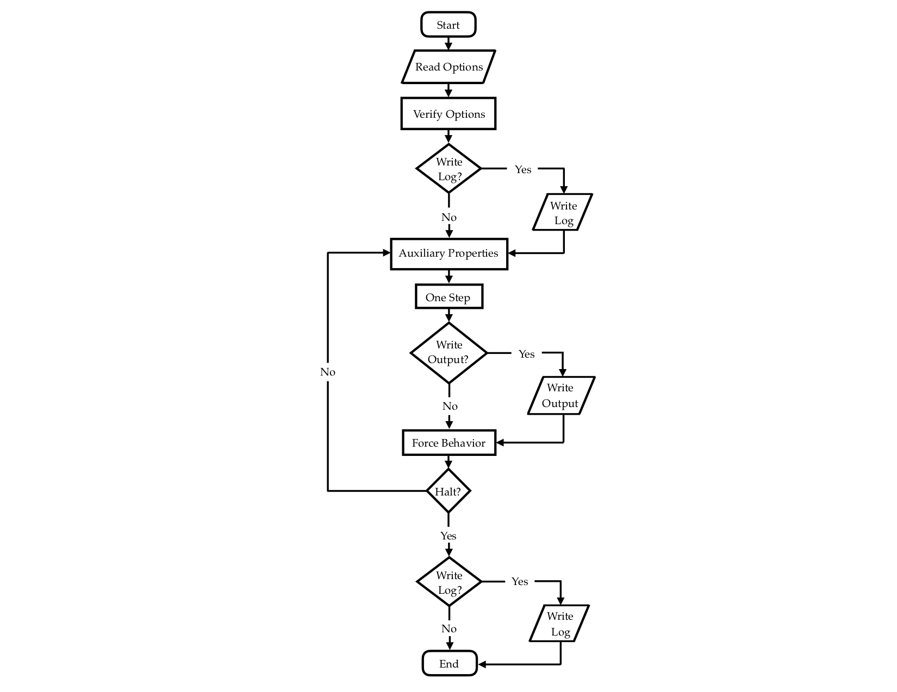

VPLanet Architecture
====================

This guide describes the fundamental feature of VPLanet's architecture,
including its flow chart, data structures, and its framework for model
comparison. Afterwards, we present a brief introduction to function pointer
arrays.

VPLanet's Flow Chart
--------------------

VPLanet has been designed to operate in a linear fashion with very few decision
points. The key steps are 1) read the input options, 2) verify the options, 3)
write the initial conditions to a log file, 4) integrate the system while
outputting results, and 5) write the final conditions to the log file. In
graphical form, here is the flow chart.

Reading Options
~~~~~~~~~~~~~~~

The first step in the code's execution is to read in the options specified by
the user and a function called ReadOptions. These instructions are in ASCII text
files and are typically called
the "infiles" as the team has traditionally used the extension .in with them.
The infiles contain "options" that are described in the modules and options
page, as well as with the -h and -H command line flags.

At this stage, numerous simple checks
are performed on the input, such as ensuring that arguments to an option are not
unphysical, e.g. eccentricities less than 0. Each of these checks must only
apply to an individual option. More complicated checks are handled
in Verify.

.. note::

  Some arrays and matrices are allocated prior to the ReadOptions call.

Verifying Options
~~~~~~~~~~~~~~~~~

Once all the options have been read in, the data are passed to Verify, which is
one of the most complicated aspects of the code. It's in Verify that the options
are checked for self-consistency. For example, if a user inputs mass, radius and
density for a body, it's very unlikely they are all consistent at machine
precision. These sorts of quality control issues are handled in Verify.
Additionally, it is in Verify that most arrays and matrices, including function
pointers, are allocated. The entry point to this process is in
verify.c:VerifyOptions.

Because any given verification step is likely unique, there is not a universal
standard for verification. As a developer, you must determine how best to
confirm that the user has asked for a valid simulation. A primary goal of
VPLanet is to provide a user-friendly code that identifies all inconsistent
input because its interdisciplinary nature makes it easy for a user to request
an unphysical simulation.

That said, many generic problems have already been identified and solution have
been implemented. If you are working on a verification step, you should check
verify.c and all the module files to see if a solution has been presented. Note
that the modules all have subroutines called something like VerifyAtmEsc that
performs verification steps that are unique to that module.

Writing to the Log
~~~~~~~~~~~~~~~~~~

VPLanet includes functionality to thoroughly document each simulation, and one
of the primary methods for this feature is the log file. Writing a log file is
optional, but it is highly recommended for both sanity checks, as well as for
use with its support scripts. If the user elects to write a log file, it will
occur after verification **and** after the integration (if an integration is
requested). In other words the log file provides a snapshot of the initial and
final conditions of the simulation.

The log file records the value of each output in system units (SI). While
options can be input in a wide range of units, recording the state in system
units allows users to determine if they have input something incorrectly, and
also helps developers identify bugs.

.. note::

  If a user requests an output with a negative sign, which forces a specific
  unit, then the value in the log file will not be SI, but the custom units
  associated with that output.

For example, a log file entry might look like this:

.. code-block:: bash

  (Age) System Age [sec]: 3.155760e+14

This line provides basic information about a body. In this case it's the age of
the body. The first field, in parentheses, is the output name, i.e. a user could
copy and paste that string into the argument list of saOutputOrder and its value
at each output time would be included in the output file. The next field is a
short description of the output. Next, in brackets, is the units of the output,
and finally the actual value of the parameter is listed. The log file breaks all
these outputs down by body, module, and initial/final conditions.

System Integration
~~~~~~~~~~~~~~~~~~

After verify and possible logging, the code will then begin integrating the
system of equations that are required based on the options. The integration is
broken down into five steps: Auxiliary Properties (sometimes shortened to
AuxProps), One Step, Output, Force Behavior, and Halt.

.. note::

  If the user does not select a forward or backward integration, but does elect
  to write a log file, then the code will calculate all the initial conditions
  and write them to the log. This feature can be useful if one just wants to
  assess the current state of a system.

**Auxiliary Properties**: Prior to moving the system one step forward, the code
calculates "helper" variables that make the code easier to parse. While strictly
speaking the code would be faster if these parameters were not calculated
separately, the VPLanet team has found that the code is much easier to read and
debug with this step. There are not strict rules for what should or should not
be an auxiliary property, but given that they are calculated every step, you
should be judicious in their use.

**One Step**: After calculating the auxiliary properties, the code is now ready
to take a step forward. Currently two integration schemes have been implemented
in VPLanet: Euler and 4th order Runge-Kutta. The former is strongly discouraged
and should only be used for testing/educational purposes.

**Output**: After taking one step, the code then compares the new simulation
time to the output interval. If it's time for an output, the WriteOutput
function is called and all outputs are sent to the output file(s), usually
designated as .forward or .backward depending on the direction of evolution that
was selected.

**Force Behavior**: Next the code determines if any fundamental change needs to
be implemented. For example, if all the water is lost from a planet's
atmosphere, then that value should be set to 0 and the function pointer in
fnUpdate should be updated to point to fdTiny, i.e. water loss should no longer
occur. The details of this step are unique to each module and there are no
strict guidelines here. As with Verify, check the module files for methods that
might work for your given problem.

**Halt**: The final step in the integration is to check for halts, which are
conditions that cause the code execution to end. For example, a user may want to
stop the code if all the water is lost from a planet. If this occurs, the code
will write one more output to the .forward/.backward files at the time the
halting condition was triggered. Note that the final conditions will still be
written to the log file in the event of a halt.

Data Structures
---------------

VPLanet consists of 8 data structures (structs) that contain all the informaton needed
to perform a simulation: Control, Body, System, Update, Module, Files, Options,
and Output. Additionally, it uses 3 function pointer arrays/matrices:
fnReadOption, fnWriteOutput, and fnUpdate.

Control
~~~~~~~

The Control struct contains all the variables related to how the code runs. Some
of these variable are housed inside 4 additional structs: Halt, Io, Evolve, and
Units. Many of the variables in the main Control struct are function pointer
arrays that enable individual modules to control the execution.

**Halt**: This struct contains information on all the halting conditions.

**Io**: This struct contains the variables on how VPLanet prints to the screen
and to files.

**Evolve**: This struct contains the data related to how VPLanet integrates a
system, including function pointer vectors for BodyCopy.

**Units**: Information on the units, both input and output, for all bodies and
files.

Body
~~~~

The Body struct contains all the physical and orbital variables associated with
each body in a system. It is initialized as an array with a length equal to the
number of object in the system, i.e. the number of arguments to saBodyFiles.
This struct is very large and is not broken down into substructs, but if you add
a new member to the struct, please include it in the block of text associated
with the module, or, if a multi-module property, add it to the general block. No
variables associated with integration, I/O, or multi-body properties should be
part of the Body struct.

System
~~~~~~

The System struct contains data relevant to multi-body properties, typically
parameters associated with orbital dynamics. As with the Body struct, no
variables associated with integration or I/O should be included, and single body
properties should be put in the Body struct.

Update
~~~~~~

The Update struct contains the variables related to how each primary variable is
advanced during an integration. This includes the size of the function pointer
matrix (fnUpdate), the variable associated with each element of that matrix, and
the instantaneous derivatives of each primary variable as a function of time.

Module
~~~~~~

This struct contains information related to how the modules interact for a given
body. Most of the member of this struct are function pointer matrices, with
some variable for keeping track of which modules are applied to which body.

Files
~~~~~

The Files struct contains the relevant data for input and output files, which
are divided into structs called Infile and Outfile. These two structs contain
information about file names and output parameters. The one exception is that
the line number in an input file associated with a give option is recorded in
the Options struct.

Options
~~~~~~~

This struct contains all the data that describe the options, such as its name
default value, associated module(s), etc. Note that the function that reads the
option is not included (because it must take the Options struct as an argument).

Output
~~~~~~

The Output struct is analogous to Options, except for output. Note that the
parameters for the output files, e.g. the .forward files, are stored in
Files.Outfile.

fnReadOption, fnWriteOutput, and fnUpdate
~~~~~~~~~~~~~~~~~~~~~~~~~~~~~~~~~~~~~~~~~

fnReadOption and fnWriteOutput are function pointer vectors that contain the
list of functions for reading in options and writing outputs, respectively.
fnUpdate is the matrix of function pointers for the derivatives. It is the core
of :code:`VPLanet` and is the feature that allows the dynamic assembly of the modules.

Framework for Model Comparison
------------------------------

:code:`VPlanet` is designed so that certain model assumptions can be grouped
together, similar to a macro. Depending on the "model" selected for a given
module physical and/or orbital parameters of the body will behave differently.
For example, EqTide module, which computes planetary tides, includes the
option "sTideModel" with options CPL and CTL, two competing models. With
:code:`VPlanet`, the user can design experiments that test the assumptions of
the two tidal models, which are qualitatively different, while holding
everything constant. Note that not all modules have models.

Function Pointers
-----------------

As VPLanet relies heavily on vectors and matrices of function pointers, but they
are not commonly used in scientific software, we provide a brief introduction to
them here. A function pointer is a variable that contains the memory address of
a function. For example, consider the following C code that shows how to use a
*scalar* function pointer:

.. code-block:: bash
  :linenos:

  #include <stdio.h>

  typedef double (*fnptr)(double,double);

  double foo(double a, double b) {

    return a*a + b;
  }

  int main() {
    fnptr;
    double x,y,z;

    x=4;
    y=0.1;

    fn = &foo;

    z = fn(x,y);

    printf("%lf\n",z);
    return 0;
  }

Line 3 defines a new variable case that is a function pointer that returns a
double and accepts 2 doubles as arguments. We then define a function called foo
that matches the requirements for fnptr. In the main routine, we define a new
variable called fn and assign the address of foo to it. We then call the
variable fn, which is a pointer to foo, and pass the arguments as with a normal
function. Compiling and executing this code prints 16.100000 to the screen.

Now let's turn fn into an array:

.. code-block:: bash
  :linenos:

  #include <stdio.h>
  #include <stdlib.h>

  typedef double (*fnptr)(double,double);

  double foo(double a, double b) {

    return a*a + b;
  }

  double bar(double a, double b) {

    return a + b*b;
  }

  int main() {
    fnptr *fn;
    double x,y,z;

    x=4;
    y=0.1;

    fn = malloc(2*sizeof(fnptr));

    fn[0] = &foo;
    fn[1] = &bar;

    z = fn[0](x,y);
    printf("%lf\n",z);

    z = fn[1](x,y);
    printf("%lf\n",z);

    return 0;
  }

Executing this code will print 16.100000 and 4.010000 to the screen on two
consecutive lines. This framework can be extended to multiple dimensions, but we
won't show that here. For VPLanet, the fnUpdate variable is 3 dimensions: one
for the bodies, one for their primary variables, and one for the processes. In
other words fn[1][2][3] is the function that returns the derivative of the 2nd
body's third derivative's 4th process, which in the cases of a DistOrb run of
Solar System could be the contribution of Mars to the eccentricity evolution of
Venus.

While this functionality is extremely powerful, it does come with pitfalls,
especially when debugging. Misassigning functions or inadvertently overwriting
memory can be extremely difficult to catch with print statements. For this
reason we strongly recommend using a debugger, such as gdb or lldb, when
developing VPLanet. In particular, we have found the watchpoint feature of
these utilities to be invaluable as the debugger will catch when a function pointer
element is overwritten. The function pointer matrices are also a primary
motivating factor in employing advanced software tools like valgrind and
address-sanitizer, which monitor memory calls for use of unitialized memory,
memory writes that are out of bounds (writing to memory beyond that which was
allocated to a variable), etc.
