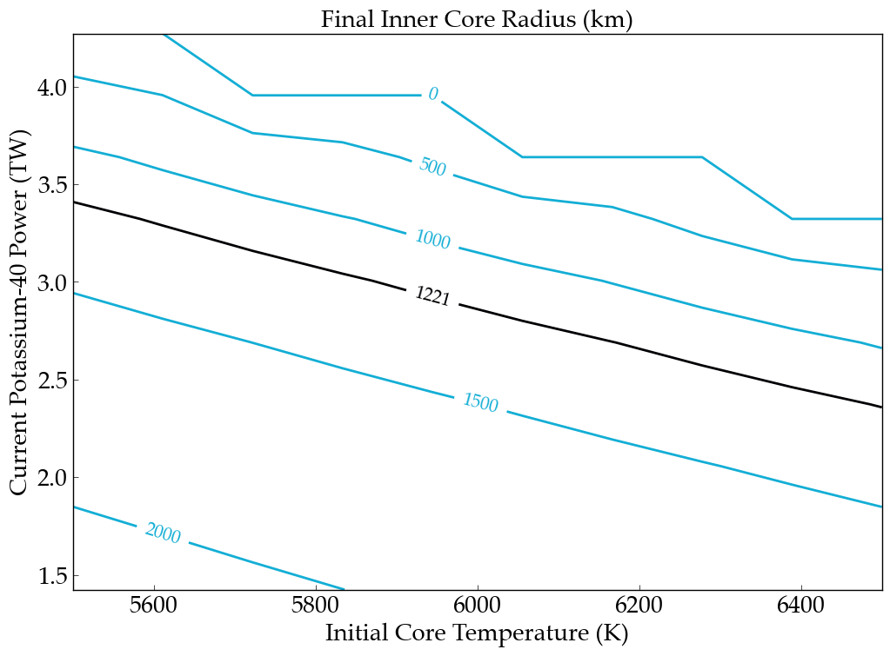

Parameter Sweep Guide
===================

Parameter sweeps are a very common use of ``VPLanet``, and the team has
developed a set of Python and command line tools to facilitate their completion
and analysis. In brief, :code:`VSPACE` builds a set of initial conditions,
:code:`multi-planet` performs the simulations, and :code:`BigPlanet` compresses the data
and streamlines analysis. The following guide explains how to use these
tools with an example based on Earth's internal thermal evolution. Files for the example
presented here can be found in `examples/ParameterSweep
<https://github.com/VirtualPlanetaryLaboratory/vplanet/tree/master/examples/ParameterSweep>`_
in which we examine the current radius of Earth's inner core as a function of the initial
core temperature and the current amount of radiogenic heating from potassium-40.

.. note::

    You need to install :code:`vplot`, :code:`VSPACE`, :code:`MultiPlanet`, and :code:`BigPlanet` to
    reproduce this example.

Initializing Parameter Sweeps with :code:`VSPACE`
------------------------

The first step is to create an input file for :code:`VSPACE`, which is typically called `VSPACE.in`.
As described in more detail in :code:`VSPACE`'s `documentation
<https://virtualplanetarylaboratory.github.io/VSPACE/>`_, this file
modifies template files (here we use the ``VPLanet`` input files from `examples/EarthInterior
<https://github.com/VirtualPlanetaryLaboratory/vplanet/tree/master/examples/EarthInterior>`_)
and then builds a directory structure with each
folder containing the input files for a specific simulation. In this guide we vary
dTCore (initial core temperature) and d40KPowerCore (initial radiogenic power from potassium-40).

Here’s the input file for :code:`VSPACE`:

.. code-block:: bash

    sSrcFolder ~/vplanet/examples/EarthInterior
    sDestFolder ParameterSweep
    sTrialName test_

    sBodyFile   sun.in

    sBodyFile   earth.in

    dTCore [5500, 6500, n10] tcore
    d40KPowerCore [-1.5, -0.5, n10] K

    sPrimaryFile   vpl.in

This file directs :code:`VSPACE` to vary initial core temperature from 5500 to 6500 in 10 steps and
initial potassium-40 power from 50 - 150% of Earth's nominal initial amount. The directories will be built in a folder called
ParameterSweep and the individual folders will be called test_tcore?K?, where the
"n" tells :code:`VSPACE` to create 10 evenly spaced values for each (other distributions are available), so the total number of
simulations will be 100.

To build the files, run the following command:

.. code-block:: bash

    vspace [-q -f] vspace.in

This command will create the folder ParameterSweep, with 100 folders
inside of it, each with their own sun.in, earth.in and vpl.in with the
parameters from the EarthInteror example, but with dTCore and d40KPowerCore changed
based on the instructions in the VSPACE.in file. Use ``-q`` to suppress output and ``-f`` to force :code:`VSPACE` to overwrite previous
data (including any :code:`MultiPlanet` and :code:`BigPlanet` files!). Now we are ready to run the parameter sweep.

.. note::

    If you randomly generate initial conditions, i.e. Monte Carlo, then :code:`VSPACE` automatically creates histograms of the
    options you varied so you can confirm the initial conditions. These png files are located in *destfolder*.

Running Simulations with :code:`MultiPlanet`
-------------------------

:code:`MultiPlanet` is the command line tool to run the simulations created with :code:`VSPACE`
across the processors on your computer. To run, type the following in the
command line:

.. code-block:: bash

    multiplanet -c <num_cores> [-q -bp] vspace.in

The optional argument ``-c`` (or ``--cores``) tells :code:`MultiPlanet` the number of cores to run.
The ``-bp`` flag creates `"BigPlanet archive <https://virtualplanetarylaboratory.github.io/bigplanet/filetypes.html>`_
directly after the simulation completes, but we are going to leave it at the default
setting, which is false. See the :code:`MultiPlanet` `documentation
<https://virtualplanetarylaboratory.github.io/multi-planet>`_ for
more information. Use the -q option to suppress output to the terminal.

.. note::

    The default number of cores :code:`MultiPlanet` will use is the maximum number of
    cores on the machine.

Checking :code:`MultiPlanet` Progress with :code:`mpstatus`
-------------------------

This example is quick to run (~1 minute, depending on the number of cores), but for
longer simulations it is often
helpful to know how far along the parameter sweep is. The command :code:`mpstatus` returns the
current state of the :code:`MultiPlanet` process. To check the current status, type the
following command:

.. code-block:: bash

    mpstatus vspace.in

This command returns output like the following to the terminal:

.. code-block:: bash

      --MultiPlanet Status--
    Number of Simulations completed: 35
    Number of Simulations in progress: 6
    Number of Simulations remaining: 59

But with the proper numbers shown.

.. warning::

    If you decide to *rerun* a parameter sweep, you must delete the checkpoint file! 
    The name of this file is ``.sDestFolder``, where sDestFolder is the option in :code:`VSPACE`
    the provdes the name for the directory that contains the simulations. If you do not delete
    this file, the :code:`MultiPlanet` will conclude your sweep has finished and will not restart
    the simulations.

After :code:`MultiPlanet` completes, you may have a large number of directories with gigabytes
of data. Storing, analyzing, and plotting these data can be tedious as each output file
from each directory must be opened and read in sequentially. To streamline this process,
use :code:`BigPlanet`.

Compressing Data with :code:`BigPlanet`
-------------------------------

The :code:`BigPlanet` command compresses your parameter sweep data into an HDF5 file in which
specific data can be efficiently extracted. **Although compression can take some time,
plotting with a** :code:`BigPlanet` ** file can be orders of magnitude faster because the script will
not need to open files and each directory!** Here we demonstrate the typical workflow of building a biplanet file.
To compress the data, type the following command in the terminal (after MultiPlanet
finishes):

.. code-block:: bash

    bigplanet -c <num_cores> [-a] bpl.in

The BigPlanet arguments work similarly to :code:`multiplanet`’s with the user able to
specify the number of processors :code:`BigPlanet` can use. The only difference is that
BigPlanet uses a bpl.in file, which is *very* similar to a vspace input file. 

Here’s the input file for :code:`BigPlanet`:

.. code-block:: bash

    sDestFolder ParameterSweep
    sArchiveFile ParameterSweep.bpa
    sOutputFile ParameterSweep.bpf

    saBodyFiles   earth.in sun.in
    sPrimaryFile   vpl.in

    saKeyInclude earth:TCore:initial earth:40KPowerCore:final earth:RIC:final

This will create an `HDF5
<https://en.wikipedia.org/wiki/Hierarchical_Data_Format>`_ file
that shares the same name as the destfolder from the :code:`VSPACE` file, but with ".bpf" or ".bpa"
appended, depending on what type of BigPlanet file. In this case, we are creating ParameterSweep.bpf. 
This file will now replace the directory structure created by :code:`VSPACE`. 
The -a option is for creation of an archive file (the .bpa file), which has **everything** from
the destfolder created with :code:`VSPACE` and the data generated from :code:`MultiPlanet`.

.. note::

    The default number of cores :code:`BigPlanet` will use is the maximum number of
    cores on the machine.

Checking :code:`BigPlanet` Progress with :code:`bpstatus`
-------------------------

For large data sets, :code:`BigPlanet` may take several hours or more to complete. To check the
status, use :code:`bpstatus`, which employs the same syntax as :code:`mpstatus` above.

Extracting and Plotting with :code:`BigPlanet`
------------------------------

After you have compressed your data, you need to access it. To accomplish this goal,
:code:`BigPlanet` is also a python module that can be imported into python scripts for the
extraction of data from the HDF5 file. For our example, final inner core radius as a function of
current potassium-40 abundance in the core and the initial core temperature, the script looks like
this:

.. code-block:: python

  import bigplanet as bp
  import matplotlib.pyplot as plt
  import vplot as vpl

  data = bp.HDF5File(‘ParameterSweep.bpf’)

This loads in the necessary modules and reads in the HDF5 file as data. Now we are
ready to extract the data we want to graph, which are the initial values of TCore,
final values of potassium-40 power, and final values of the inner core radius. Let's
start with inner core radius, grabbing its final values and its units:

.. code-block:: python

    RIC = bp.ExtractColumn(data,'earth:RIC:final')
    RIC_units = bp.ExtractUnits(data,'earth:RIC:final')

ExtractColumn returns an array in which each element corresponds to the final
value of the inner core radius for each simulation. The first argument is the HDF5
file, the second argument is called a "key" and describes a parameter of
interest. To learn more about keys, consult the `BigPlanet documentation
<https://github.com/VirtualPlanetaryLaboratory/vplanet/tree/master/multi-planet>`_.
In brief, the key syntax is "body_variable_aggregation", in
which aggregation is some property of a body's variable, e.g. the final value. The
second line returns the units of the key.

Next we want to grab the *x* and *y* values for our contour plot. This step is a bit complicated
because a specific value of *x* and/or *y* can be repeated multiple times. In other words,
if we just extracted every value from every simulation and placed it in an array, the
arrays would be multi-valued and the plot could not be built.  To obtain the values
needed for the plot, use the ``ExtractUniqueValues`` function, like so:

.. code-block:: python

    TCore_uniq = bp.ExtractUniqueValues(data,'earth:TCore:initial')
    TCore_units = bp.ExtractUnits(data,'earth:TCore:initial')

    K40_uniq = bp.ExtractUniqueValues(data,'earth:40KPowerCore:final')
    K40_units = bp.ExtractUnits(data,'earth:40KPowerCore:final')

Now we have the values we need for our plot, but the inner core radius is currently
stored as an array, not a matrix, so we're still not ready to plot. With :code:`BigPlanet` you
can easily transform an array into the appropriately shaped matrix with the ``CreateMatrix``
function:

.. code-block:: python

  RIC_Matrix = bp.CreateMatrix(TCore_uniq,K40_uniq,RIC)

This method takes 3 arguments and 1 optional argument, the *x*-axis vector, the *y*-axis vector, the array
that must be converted into a 2D matrix and an optional orientation argument.

Now we're ready to plot using :code:`vplot` and :code:`matplotlib.` We won't show the lines of code here,
but remember this example is included in `examples/BigPlanetExample
<https://github.com/VirtualPlanetaryLaboratory/vplanet/tree/master/examples/BigPlanetExample>`_.
Ultimately, you will obtain the following plot, which includes a black curve for the current value
of Earth's inner core radius.

Creating Meta-Data Files with :code:`BigPlanet`
----------------------------

Finally, it's often convenient to write out ASCII files in which each line contains the meta-data
for your parameter sweep, e.g. the initial eccentricity, the final semi-major axis, and the maximum
inclination. :code:`BigPlanet` facilitates the creation of these files with the ``ArchiveToCSV`` method:

.. code-block:: python

    ArchiveToCSV(inputfile, columns, exportfile, delim=" ", header=False, ulysses=0)

where:

*inputfile* is the name of the HDF5 file

*columns* is the list of keys you are extracting, i.e. the output from calls to ExtractColumn

*exportfile* is the name of the output file

*delim* is the delimiter for the output file (the default is spaces)

*header* adds the names and units for each column (default is False)

*ulysses* makes the file compatible with `VR Ulysses <https://www.vrulysses.com/>`_ (default is 0)

You are now ready to efficiently explore your parameter space!
