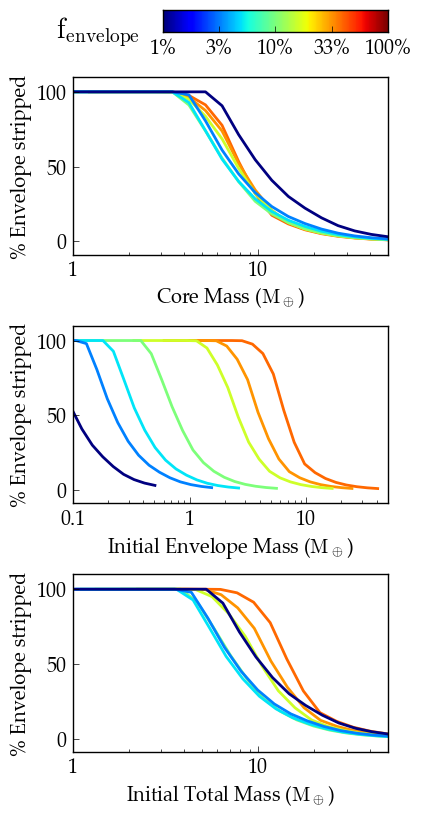

Kepler-36 Atmospheric Escape
============================

Overview
--------

===================   ============
**Date**              06/28/18
**Author**            Rodrigo Luger
**Modules**           atmesc
                      stellar
**Approx. runtime**   31 seconds
**Source code**       `GitHub <https://github.com/VirtualPlanetaryLaboratory/vplanet-private/tree/master/examples/kepler36>`_
===================   ============

A reproduction of Figure 3 in Lopez and Fortney (2013) :cite:`LopezFortney2013`
using **VPLANET**.

To run this example
-------------------

.. note::

    You might need to install :code:`tqdm`:

    .. code-block:: bash

        pip install tqdm

.. code-block:: bash

    python makeplot.py <pdf | png>

Expected output
---------------

   Percentage of the planet's gaseous enveloped stripped via hydrodynamic
   escape as a function of core mass (top), initial envelope mass (center),
   and initial total mass (bottom), for different initial envelope mass
   fractions (colors). The core mass is the best predictor of the amount of
   gas that is stripped by hydrodynamic escape.
