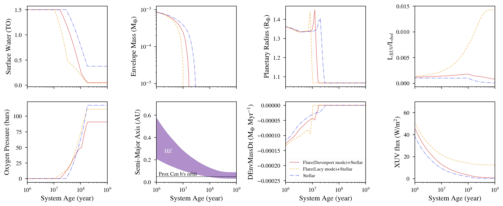

Proxima Centauri b Atmospheric Escape
============================

Overview
--------

Loss of a hydrogen envelope, surface water and build-up oxygen due to stellar+flares XUV stripping.

===================   ============
**Date**              11/22/21
**Author**            Laura Amaral
**Modules**           AtmEsc
                      FLARE
                      STELLAR
**Approx. runtime**   23 seconds
===================   ============

This example shows the evolution of the planetary parameters of Proxima Centauri b, comparing when the planet is
reached by flares with a constant FFD, a FFD time-dependent and when only the quiescent XUV luminosity is consider.

To run this example
-------------------

.. note::

    You might need to install :code:`tqdm`:

    .. code-block:: bash

        pip install tqdm

.. code-block:: bash

    python makeplot.py <pdf | png>

Expected output
---------------

   Surface water content (top left),  envelope mass (top center left),
   planetary radius (top center right) quiescent+flares XUV luminosity
   and bolometric luminosity ratio (top right), oxygen content in the
   atmosphere (bottom left), habitable zone location (bottom center),
   envelope loss rate (bottom center right) and XUV flux (bottom right).
