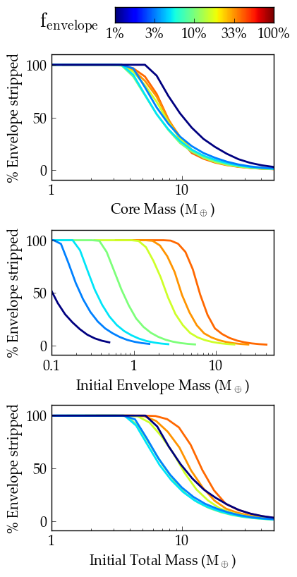

Kepler-36 Atmospheric Escape
============================

Overview
--------

Loss of a hydrogen envelope due to stellar XUV stripping.

===================   ============
**Date**              06/28/18
**Author**            Rodrigo Luger
**Modules**           AtmEsc
                      STELLAR
**Approx. runtime**   31 seconds
===================   ============

Hydrogen-rich planets that are close to their host star can lose significant mass
as the XUV radiation from the host star imparts enough energy for individual atoms
to acheive escape velocity. In this example, **VPLanet** simulates atmmospheric loss
for the case of Kepler-36 b, which is considerably smaller in radius than its very
nearby companion, Kepler-36 c. `Lopez & Fortney (2013) <https://ui.adsabs.harvard.edu/abs/2013ApJ...776....2L/abstract>`_ argue that this
radius dichotomy can be explained by XUV winds, and **VPLanet** reproduces that
result, see Figure 3 in `Lopez & Fortney (2013) <https://ui.adsabs.harvard.edu/abs/2013ApJ...776....2L/abstract>`_ .

To run this example
-------------------

.. note::

    You might need to install :code:`tqdm`:

    .. code-block:: bash

        pip install tqdm

.. code-block:: bash

    python makeplot.py <pdf | png>

Expected output
---------------

   Percentage of the planet's gaseous enveloped stripped via hydrodynamic
   escape as a function of core mass (top), initial envelope mass (center),
   and initial total mass (bottom), for different initial envelope mass
   fractions (colors). The core mass is the best predictor of the amount of
   gas that is stripped by hydrodynamic escape.
