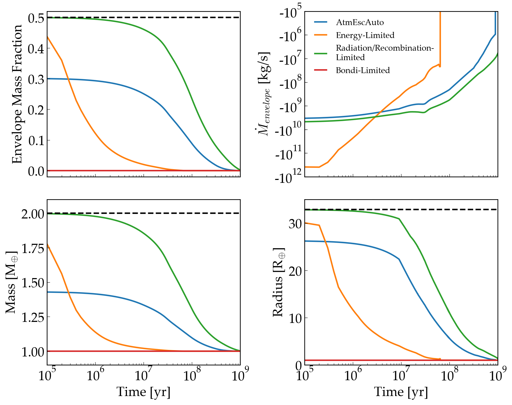
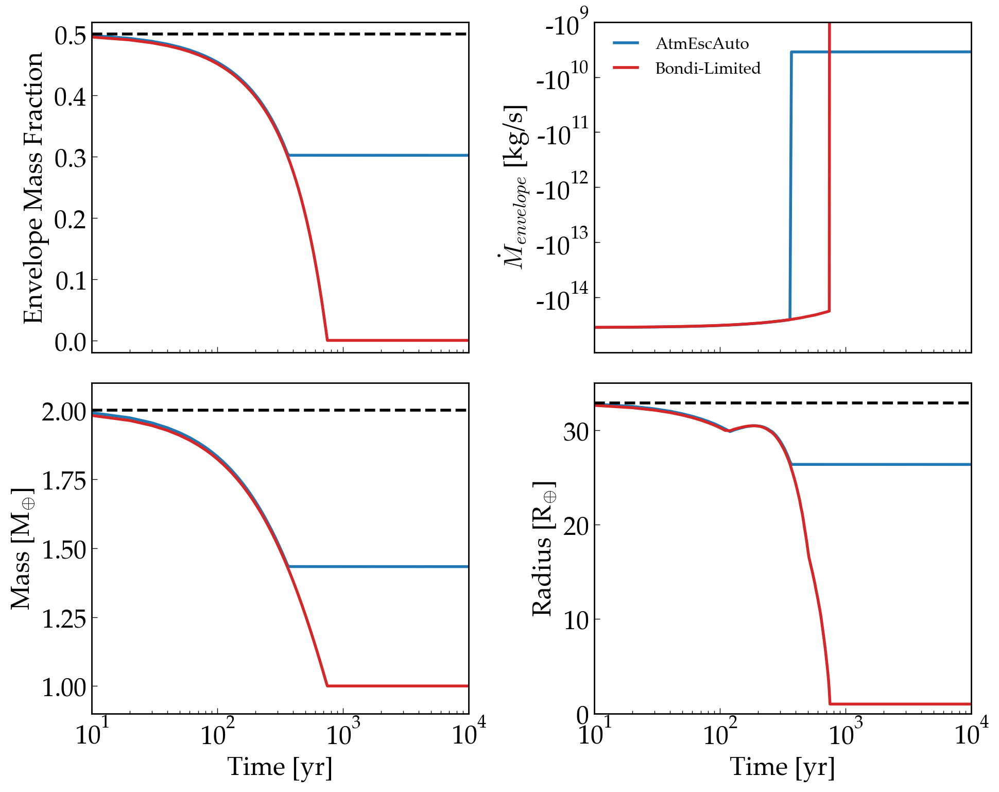

Atmospheric Erosion of H Envelopes in the Energy-, Radiation/Recombination-, and Bondi-limited Regimes
====================================================================================================

Overview
--------

This examples compares the atmospheric erosion of four planets subject
to energy-limited escape, radiation/recombination-limited escape, "Bondi-limited" escape,
and one planet whose escape regime evolves depending on its mass, radius, and
incident XUV flux. Bondi-limited escape occurs for planets overflowing their Roche lobe,
in which case particles escape at the local sound speed.

===================   ============
**Date**              09/24/19
**Author**            David Fleming
**Modules**           AtmEsc
                      STELLAR
**Approx. runtime**   70 seconds
===================   ============

To run this example
-------------------

.. code-block:: bash

    python makeplot.py <pdf | png>

Expected output
---------------

   Evolution of the H envelope mass fraction (top left), time derivative of the
   envelope mass (top center), total planet mass (top right), planet radius
   (bottom left), Critical XUV Flux (bottom center), and the H envelope escape
   regime (bottom right) for planets following AtmEscAuto (blue), energy-limited (orange),
   radiation/recombination-limited (green), and Bondi-limited escape (red). The
   black-dashed lines indicate the initial values for the respective quantities.
   All planets start with the same initial conditions. The Bondi-limited case
   rapidly loses its entire envelope. We probe this early mass loss in the figure
   below. After a few hundred years of Bondi-limited loss, the AtmEscAuto cases
   transitions to radiation/recombination-limited escape then briefly transitions
   again to energy-limited escape once the incident XUV flux exceeds the critical
   value. Shortly after, its envelope is been completely stripped.
   The energy-limited escape case rapidly loses envelope mass, eventually completely
   stripping the envelope within 100 Myr. The radiation/recombination-limited
   escape case, however, is able to retain part of its envelope for much longer
   since its mass loss rate scales as the square root of the incident XUV flux
   as opposed to scaling linearly with the flux as is the case with energy-limited
   escape. Note that the "No Escape" (black curve) in the radius panel corresponds
   to a planet whose radius contracts as the planet cools, not due to atmospheric
   escape.

    First 10,000 years of atmospheric mass-loss for the Bondi-limited (red) and
    AtmEscAuto cases (blue) with the same layout as the above figure. Early on,
    the planetary radii exceed the Roche limit and both planets experience immense
    mass loss of order 0.01 Earth masses per year! For the AtmEscAuto case after
    about 300 years of Bondi-limited envelope mass loss, the radius has
    contracted to be less than the Roche limit and AtmEsc determines that the
    escape has transitioned from Bondi-limited escape to radiation/recombination-limited
    escape as the planet still receives large incident XUV flux. The Bondi-limited
    case, however, continues to lose massive amounts of H from its envelope,
    completely stripping the envelope within 1,000 years.
