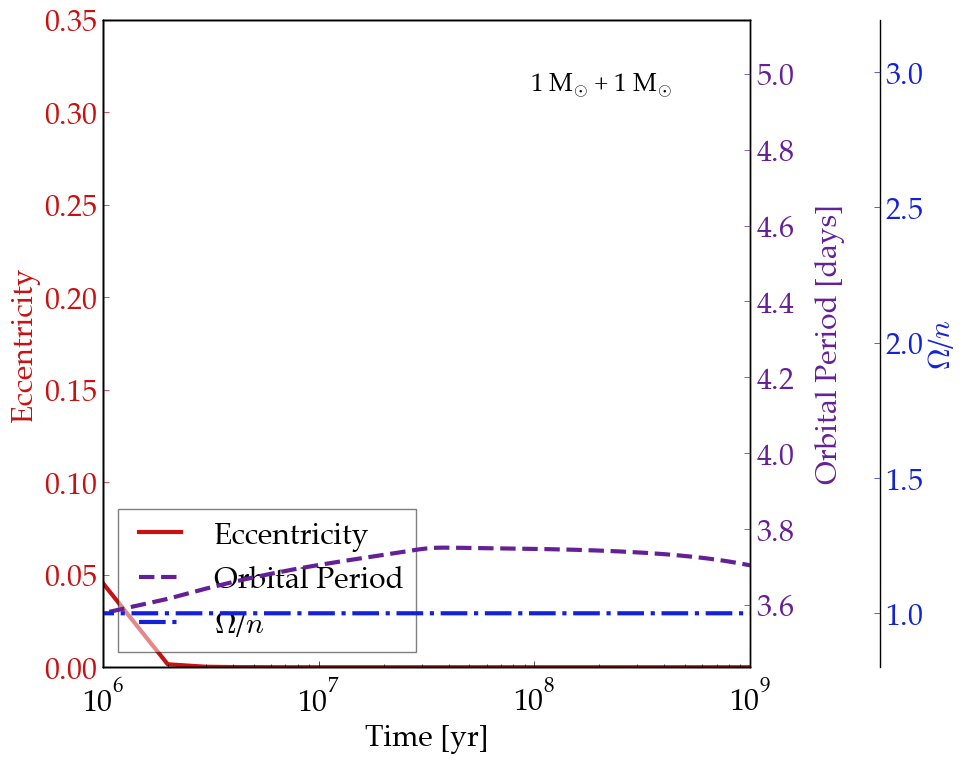

Evolution of Tight Stellar Binaries
===================================

Overview
--------

Orbital circularization of short-period binary stars due to radial contraction on
the pre-main sequence and tidal torques.

===================   ============
**Date**              07/25/18
**Author**            David Fleming
**Modules**           EqTide
                      STELLAR
**Approx. runtime**   71 seconds
===================   ============

As stars form they contract onto the main sequence, and those in binary star systems
can also experience tidal torques on the rotation and orbit. As tidal torques scale
with stellar radius to the 5th power, the torques can be very strong early on. This
early tidal evolution circularizes binary star orbits for orbital periods less than
~8 days, which is observed `Meibom & Mathieu (2005) <https://ui.adsabs.harvard.edu/abs/2005ApJ...620..970M/abstract>`_. This example reproduces Figure 1 of
`Zahn and Bouchet (1989) <https://ui.adsabs.harvard.edu/abs/1989A%26A...223..112Z/abstract>`_ using **EqTide** and **STELLAR**.

To run this example
-------------------

.. code-block:: bash

    python makeplot.py <pdf | png>

Expected output
---------------

Coupled stellar and tidal evolution of a solar twin binary from the pre-main
sequence onward as calculated with **VPLanet**'s **EqTide** and **STELLAR** modules.
Orbital eccentricity evolution is given by the red solid line, the orbital
period by the purple dashed line, and the ratio of stellar rotation rate to
binary mean motion (Omega/n) evolution is given by the blue dot-dashed curve.
The binary's evolution is very similar to that of an identical system
presented in Figure 1 of `Zahn and Bouchet (1989) <https://ui.adsabs.harvard.edu/abs/1989A%26A...223..112Z/abstract>`_.
