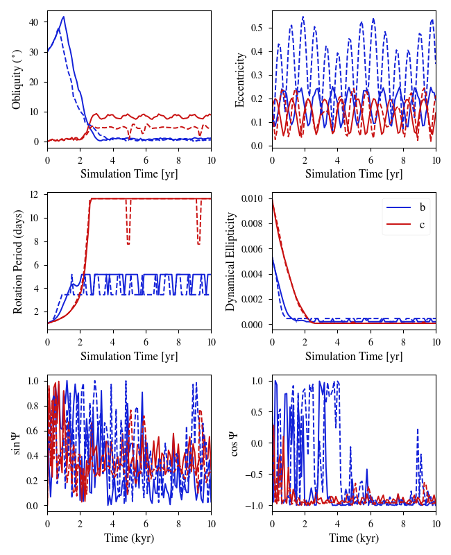

Multiple Cassini States in One System
====================================

Overview
--------

Demonstration of two planets' (Teegarden's Star b and c) obliquity evolution
under the influence of tides and gravitational perturbations from each other
Both planets damp into a "Cassini state."

===================   ============
**Date**              02/24/2020
**Author**            Rory Barnes
**Modules**           EqTide
                      DistOrb
                      DistRot
                      STELLAR
**Approx. runtime**   2 minutes
===================   ============

A damped orbital-rotational system can enter a "Cassini state," in which
a planet's rotational axis, orbital axis, and the local total angular momentum
vector are all coplanar. In this case, we consider Teegarden's Star's planetary
system, which consists of two planets that are both affected by tides from the
host star. Here we assume a mutual inclination of ~10 degrees, and all orbital
and physical parameters are consistent with the observations. We assume that
planet b has no water, but planet c does; this choice means that planet b's
damping is 10x weaker than c's. Both planet's damp into a Cassini state.

To run this example
-------------------

.. code-block:: bash

    python makeplot.py <pdf | png>

Expected output
---------------

Evolution of Teegarden's Star b and c into Cassini states. Planet b equilibrates
to an obliquity of about 1 degree, while planet c, which is potentially
habitable, damps to about 9 degrees. Note that planet b's eccentricity
occassionally reaches values larger than 0.23, where the CPL tidal model
predicts its rotation rate will switch to the 3:2 spin-orbit resonance. The
dynamical ellipticity, i.e. oblateness, is calculated by assuming hydrostatic
equilibrium, including the centripetal force.  For both planets, the second
Cassini parameter (bottom right) settles to a value of approximately -1,
indicating the presence of a Cassini state.
