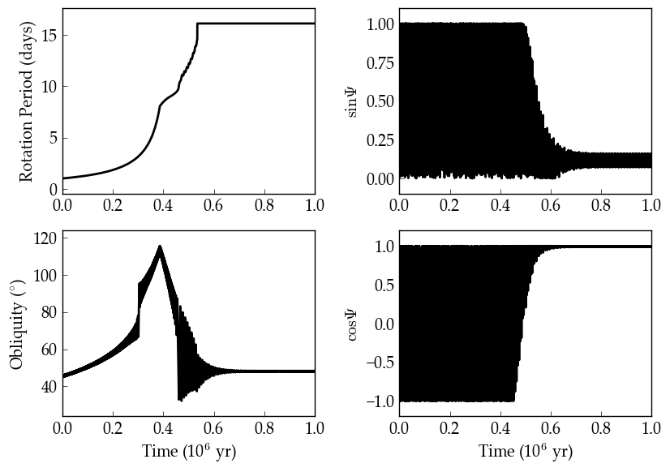
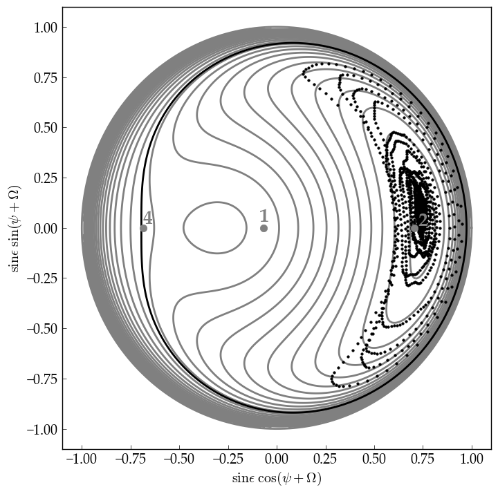

Cassini States
==============

Overview
--------

Demonstration of a planet's obliquity evolution under the influence of tides and gravitational perturbations from another planet, resulting in capture into a "Cassini state."

===================   ============
**Date**              07/25/18
**Author**            Russell Deitrick
**Modules**           EqTide
                      DistOrb
                      DistRot
**Approx. runtime**   54 seconds
===================   ============

A damped orbital-rotational system can enter a "Cassini state," in which
a planet's rotational axis, orbital axis, and the local total angular momentum
vector are all coplanar. In this case, we consider a system in which tides from the
star damp the rotation rate, obliquity, semi-major axis, and orbital eccentricity.
Tides tend to damp the rotational axis so that it is perpendicular to the orbital
plane, but perturbations from other planets drive the obliquity to higher values.
Over time, the systems settles into a damped-drived state in which the obliquity is
non-zero, but also not oscillating. This example is modeled after `Winn & Holman (2005) <https://ui.adsabs.harvard.edu/abs/2005ApJ...628L.159W/abstract>`_, see their Fig. 2.

To run this example
-------------------

.. code-block:: bash

    vplanet vpl.in
    python makeplot.py <pdf | png>

Expected output
---------------

An Earth-mass planet damping into Cassini state 2 under the influence of tides
and perturbations from an 18 Earth-mass companion planet. The bottom right panel shows a "Cassini parameter" which is locked at either 1 or -1 indicates the presence of a Cassini state. At the end of the simtulation, the inner planet is synchronously rotating, but its obliquity is approximately fixed at 60 degrees. This example is
constructed to be similar to Figure 2 of `Winn & Holman (2005) <https://ui.adsabs.harvard.edu/abs/2005ApJ...628L.159W/abstract>`_.

Phase space of the three prograde Cassini states (numbered). The gray curves
show lines of constant Hamiltonian (Equation 5 in `Winn & Holman [2005] <https://ui.adsabs.harvard.edu/abs/2005ApJ...628L.159W/abstract>`_) and the
black curve shows the separatrix between states 1 and 2. The three possible
Cassini states for this system are denoted by the light gray numbers 1, 2, and
4. This case is constructed to be similar to the illustrative case shown in
Figure 2 of `Winn & Holman (2005) <https://ui.adsabs.harvard.edu/abs/2005ApJ...628L.159W/abstract>`_, with -g/\alpha ~ 0.75 and i = 6 deg. The
location of the planet's pole after ~400 kyr is shown as the black points, with the arrows depicting the direction of evolution. As
the planet's spin is damped by tidal torques, its obliquity sinks into Cassini
state 2.
