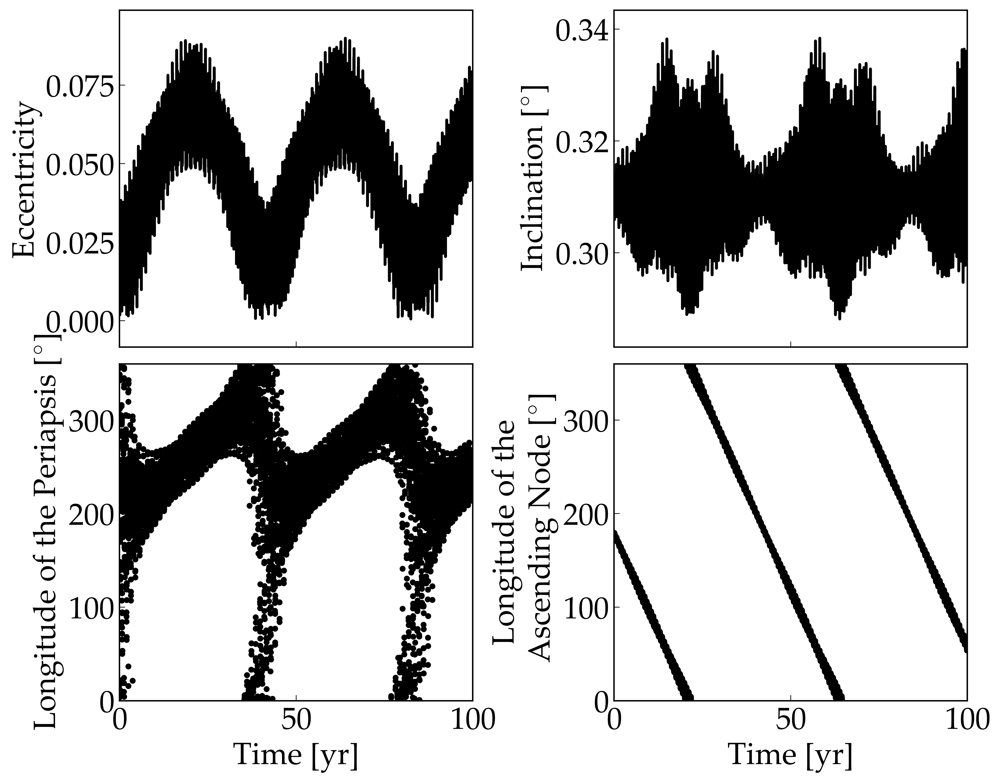

Orbital Evolution of the Circumbinary Planet Kepler-16 b
=========

Overview
--------

The orbital evolution of circumbinary planets, which varies as the host stars positions change.

===================   ============
**Date**              07/24/18
**Author**            David Fleming
**Modules**           BINARY
**Approx. runtime**   24 seconds
===================   ============

The orbital evolution of Kepler-16 b, a circumbinary planet, is shown in this example
using the semi-analytic model of `Leung & Lee (2013) <https://ui.adsabs.harvard.edu/abs/2013ApJ...763..107L/abstract>`_, see their Fig. 5. The orbit is non-Keplerian
due to the changing positions of the host stars.

To run this example
-------------------

.. code-block:: bash

    python makeplot.py <pdf | png>

Expected output
---------------

   Orbital evolution of circumbinary planet Kepler-16b according to
   **VPLanet**'s **BINARY** module.  Perturbations from the central binary
   force orbital eccentricity and inclination oscillations for the planet
   (top left and right panels, respectively) and cause appreciable precession
   of the longitudes of the periapse and ascending node (bottom left and right
   panels, respectively).
