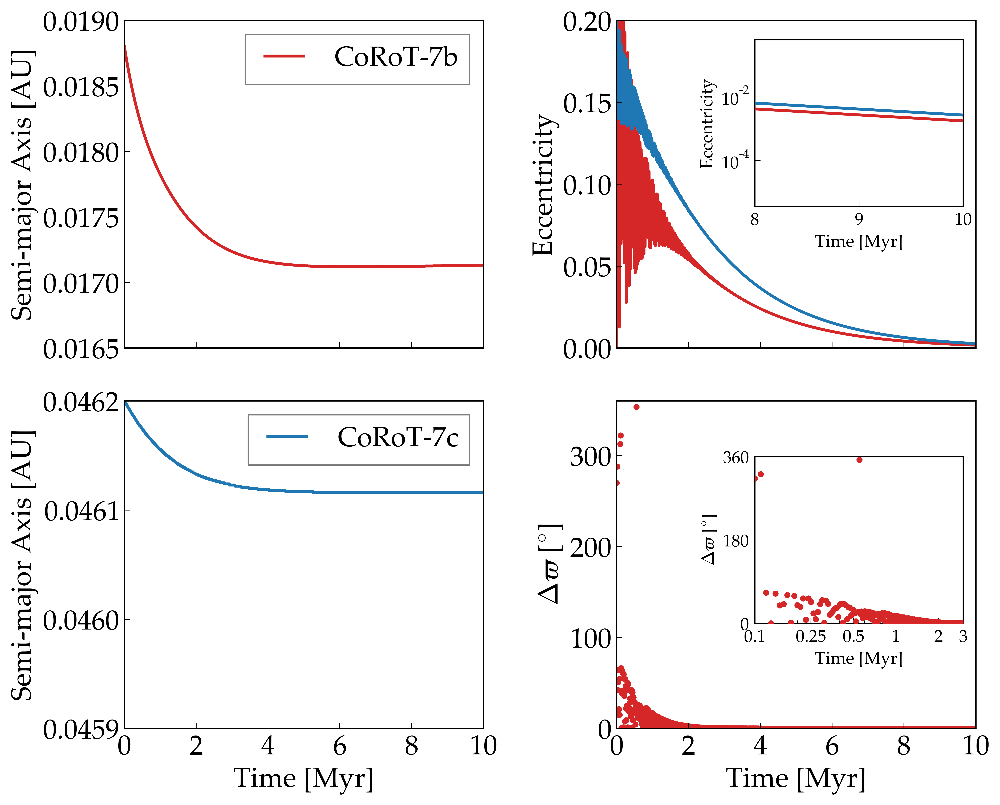

Orbital Damping in the CoRoT-7 System
=================

Overview
--------

===================   ============
**Date**              9/12/18
**Author**            David Fleming
**Modules**           distorb
                      eqtide
                      stellar
**Approx. runtime**   500 seconds
**Source code**       `GitHub <https://github.com/VirtualPlanetaryLaboratory/vplanet-private/tree/master/examples/corot7>`_
===================   ============

Using vplanet's distorb, eqtide, and stellar modules to simulate the tidal damping
and apsidal locking of CoRoT-7 b and c examined by :cite::Rodriguez11.

To run this example
-------------------

.. code-block:: bash

    vplanet vpl.in
    python makeplot.py <pdf | png>

Expected output
---------------

   Secular dynamical evolution of CoRoT-7 b and c subject to tidal damping as
   computed by eqtide and distorb based on Figures 2 and 3 from
   :cite::Rodriguez11. Top left: Semi-major axis evolution of CoRoT-7 b.
   Top Right: Eccentricity evolution for both CoRoT-7 b and c.  CoRoT-7 b's
   eccentricity is initially excited by gravitational perturbations from
   CoRoT-7 c, but eventually damps towards 0 due to tidal forces.  The inset
   shows the slightly non-zero eccentricities for planet b and c decaying
   towards 0 near the end of the simulation. Lower left: Semi-major axis
   evolution of CoRoT-7 c. Lower right: Difference between the longitudes of
   pericenters of CoRoT-7 b and c.  In the inset, we display both planets
   becoming apsidally locked within 3 Myr due to tidal damping.
