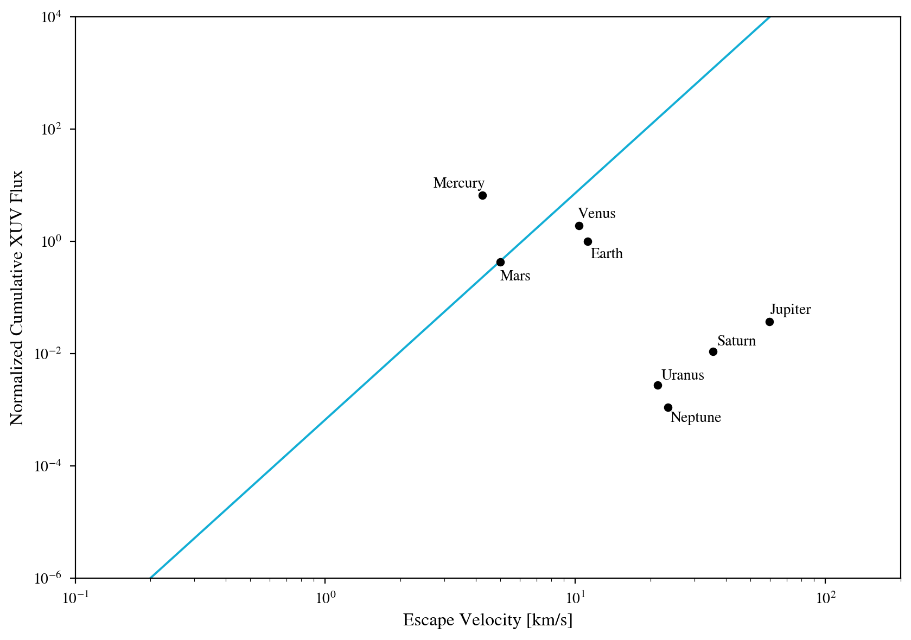

The "Cosmic Shoreline"
==========

Overview
--------

A reproduction of Zahnle & Catling (2018)'s cosmic shoreline,
a proposed boundary between planet with and without atmosphere.

===================   ============
**Date**              09/12/2024
**Author**            Rory Barnes
**Modules**           Atmesc, STELLAR
**Approx. runtime**   10 seonds
===================   ============

To run this example
-------------------

.. code-block:: bash

   python makeplot.py <pdf | png>

Expected output
---------------

The blue line is the cosmic shoreline, which is taken from Fig. 2
of Zahnle & Catling (2018). The black points are the positions
of the Solar System planets in this parameter space. The Sun's XUV luminosity
is assumed to follow the Ribas et al. (2005) model. This figure, while
not as complete as Zahnle & Catling (2018), is a near exact reproduction
of their results.
