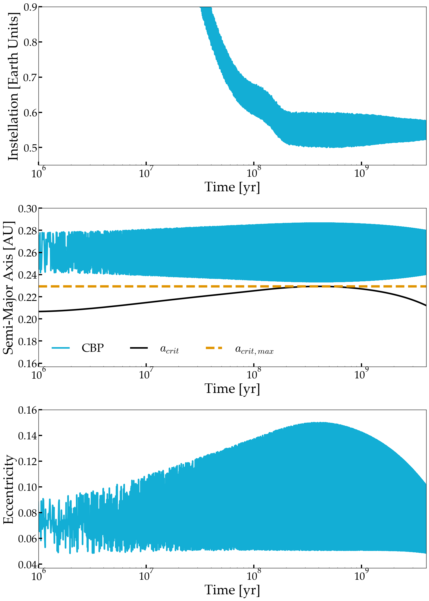

Evolution of a Planet Orbiting a Short-Period Binary
=============================================================================

Overview
--------

This example shows 5 Gyrs of the orbital evolution of a hypothetical potentially
habitrable circumbinary planet orbiting a tidally-interacting 0.5 Msun - 0.1 Msun
stellar binary. The orbit of the circumbinary planet (CBP) secularly evolves as the
orbit of the central binary evolves due to tides. This case was initially explored
by Graham et al., in prep.

===================   ============
**Date**              03/04/20
**Authors**           David Fleming, David E. Graham
**Modules**           BINARY EqTide STELLAR
**Approx. runtime**   45 minutes
===================   ============

To run this example
-------------------

.. code-block:: bash

    vplanet vpl.in
    python makeplot.py <pdf | png>

Expected output
---------------

   Instellation received by the CBP (top), the CBP orbital semi-major axis (middle),
   and CBP orbital eccentricity (bottom) vs. time orbiting a tidally-evolving
   0.5 Msun - 0.1 Msun stellar binary. The binary's orbit initially
   expands as stellar rotational angular momentum is tidally transported into the orbit,
   increasing the CBP's mean orbital eccentricity, and the amplitude of its eccentricity oscillations.
   During this period, the CBP experiences larger instellation fluctations, likely
   impacting its climate. As the binary's orbit circularizes, the CBP's mean
   orbital eccentricity and the amplitude of the eccentricities oscillations
   both decay. Note that the early expansion of the binary orbit nearly destabilizes
   the CBP.
