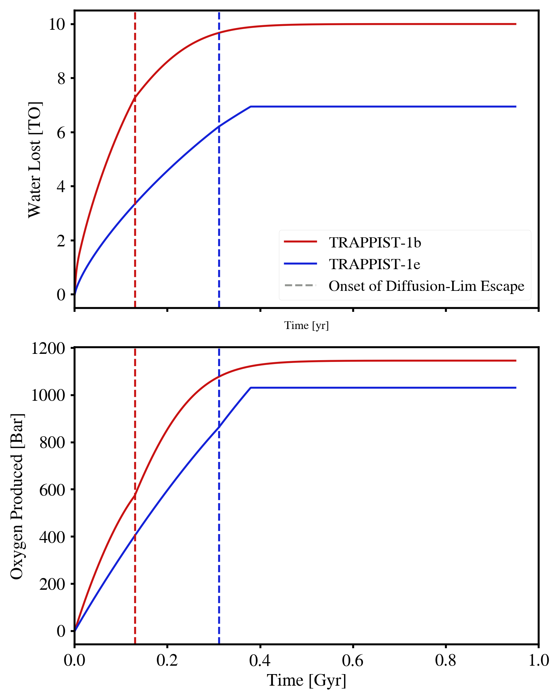

Accumulation of Atmospheric Oxygen due to Water Photolysis and Hydrogen Escape on the TRAPPIST-1 planets b and e with the LS16 Water loss model
==================================================

Overview
--------

Track water loss and oxygen build-up due to hydrodynamic atmospheric escape.

===================   ============
**Date**              08/21/2023
**Author**            Megan Gialluca
**Modules**           AtmEsc
                      STELLAR
**Approx. runtime**   less than 1 minute
===================   ============

M dwarf stars experience particularly long and violent pre-main sequence (PMS) phases.
At this time, terrestrial planets that may be in the HZ during the main sequence experience
intense amounts of XUV radiation, typically past the runaway limit. Additionally, planets
always destined to remain interior to the HZ experience a heightened level of radiation
across the system's lifetime. In both of these cases, the planets are subjected to strong
hydrodynamic thermal atmospheric escape; in a pure water atmosphere, this photolyzes water 
molecules and allows hydrogen to escape, and drag oxygen during energy-limited escape.
During diffusion-limited escape, the escaping flow of hydrogen is throttled by a build-up of
oxygen in the upper atmosphere as opposed to limited by the incoming stellar energy. During diffusion,
oxygen drag cannot continue.
This example plots the water loss and oxygen build-up over time for the terrestrial planets 
TRAPPIST-1b (interior to HZ) and e (HZ planet). Additionally it marks the time diffusion-limited 
escape begins.

This is a recreation of the T1-e curve from Figure 2 of Gialluca et al (2023, in prep), and a 
recreation of the T1-b curve but with a differing initial water content than in the published
figure (10 TO instead of 200 TO initial for T1-b). The other change to the published version is
T1-b and e use red and blue coloring, respectively, for better contrast.

To run this example
-------------------

.. code-block:: bash

    python makeplot.py <pdf | png>

Expected output
---------------

   Water loss [TO] (top) and oxygen produced/retained [Bar] (bottom) over time [Gyr] for TRAPPIST-1b (red) and e (blue)
   for an initial water content of 10 TO [Terrestrial Oceans]. In this particular case, hydrodynamic escape is 
   halted on both planets within 1 Gyr; for T1-e escape ends due to HZ entrance at ~370 Myr and for T1-b escape ends
   due to desiccation at ~900 Myr. Both planets experience diffusion-limited escape during this simulation, which begins
   at the time indicated by the vertical dashed lines; this occurs when the mixing ratio of free oxygen in the atmosphere
   is equal to that of water in the LS16 water loss model. 

