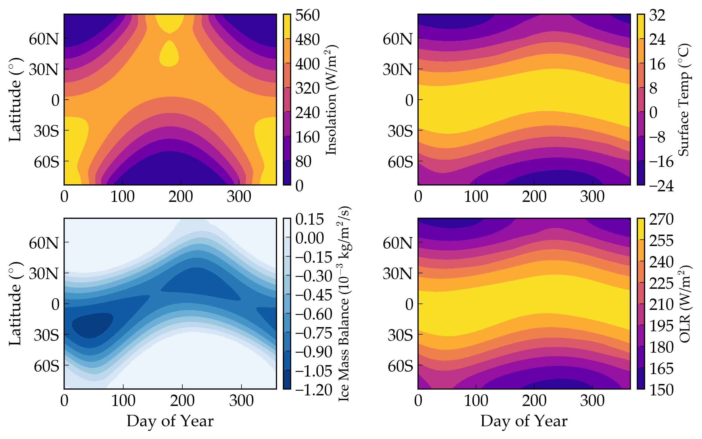
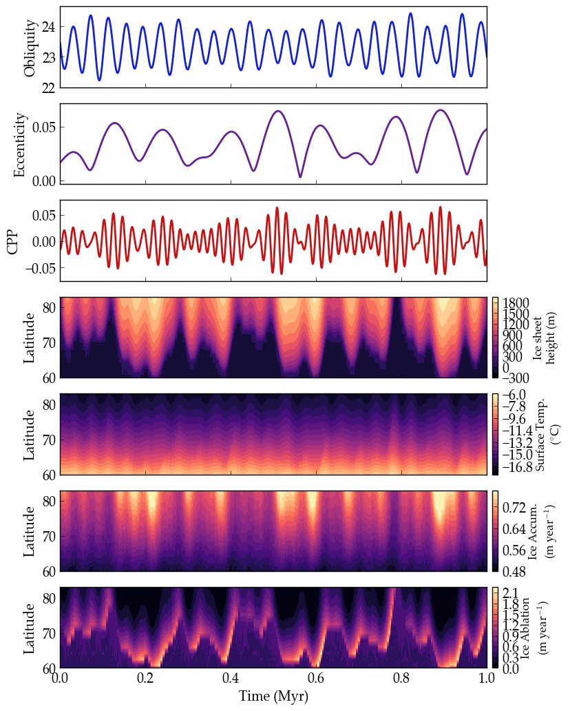

Earth's Seasonal and Milankovitch Climate Cycles
===================

Overview
--------

Annual and Milankovitch climate cycles on Earth.

===================   ============
**Date**              07/25/18
**Author**            Russell Deitrick
**Modules**           POISE
                      DistOrb
                      DistRot
**Approx. runtime**   5 minutes
===================   ============

This example validates **VPLanet**'s 1-D climate model with dynamic ice sheets over annual
and Myr timescales. On annual timescales, the seasons cycle back and forth on the
northern and southern hemispheres. On longer timescales, ice sheets grow and retreat
due to changes in eccentricity, obliquity and precession angle (the angle orthogonal to obliquity), which are caused by perturbations
from other bodies. Note that we assume every latitude grid is 75% water, 25% land
so the latitudinal extent of the ice sheets does not exactly match the geologic
record, but the frequencies and intensities do.

To run this example
-------------------

.. code-block:: bash

    vplanet vpl.in
    python makeplot.py <pdf | png>

Expected output
---------------

Insolation (upper left), surface temperature (upper right), ice mass balance
(lower left), and out-going longwave radiation (lower right), for Earth over a
single year, as modeled by **POISE**. Note that negative values in ice mass balance
represent *potential* melting, i.e. this value is calculated even in the
absence of ice on the surface.

Earth's orbital, rotational, and climate evolution over 1 Myr. The orbital and rotational evolution are modified by all the planets in the Solar System, and the Moon is included by forcing the Earth's precessional frequency to match the observed rate. CPP is the "climate precession parameter." The bottom four panels show key properties of the climate state, as indicated by the color bars and axes on the right. Compare to Fig. 4 in `(Huybers & Tzipermann 2008) <https://ui.adsabs.harvard.edu/abs/2008PalOc..23.1208H/abstract>`_.
