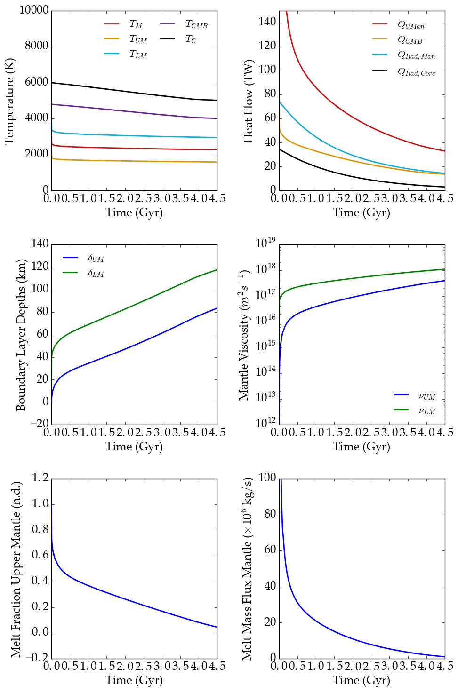
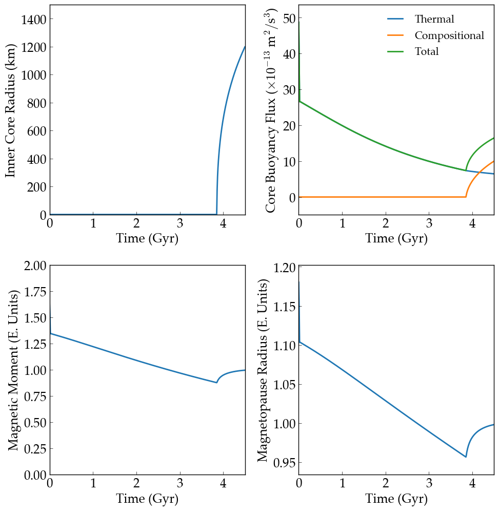

Thermal and Magnetic Evolution of Earth's Interior
==========

Overview
--------

This example shows how Earth's interior evolves in a plate tectonics-like mode.

===================   ============
**Date**              10/03/18
**Author**            Peter Driscoll
**Modules**           RadHeat ThermInt
**Approx. runtime**   <1 second
===================   ============

This example shows the thermal and magnetic evolution of Earth's interior from
**ThermInt** and **RadHeat**. The model is 1-D and many free parameters have been
tuned to reproduce Earth's current properties. Earth is divided in a core, mantle,
and crust. The evolution depends only on the temperature of the core and mantle.
These figures are similar to Fig. 5 in Driscoll & Bercovici (`2014 <https://ui.adsabs.harvard.edu/abs/2014PEPI..236...36D/abstract>`_).

To run this example
-------------------

.. code-block:: bash

   vplanet vpl.in
   python makeplot.py <pdf | png>

Expected output
---------------

Nominal thermal history of the Earth, mantle and core.  Radiogenic
heating is from **RadHeat**. Magnetic moment evolution is estimated from
the core energy balance and inner core growth.
