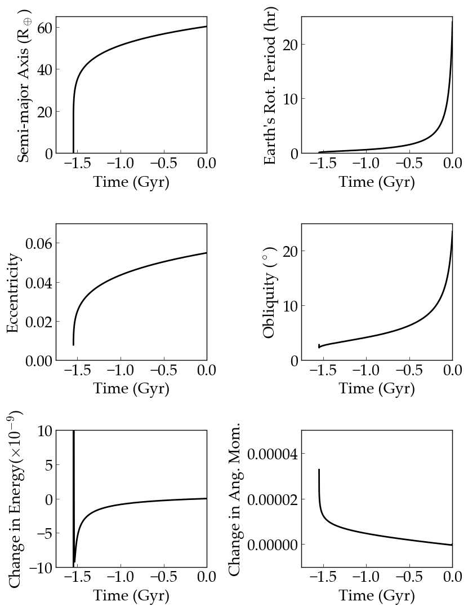

Tidal Evolution of the Earth-Moon System
==========

Overview
--------

A backward integration of the Earth-Moon system according to the constant-phase-lag
equilibrium tidal model.

Backward integrations are still unstable, and the eccentricity evolution in this
case appears suspect. Forward integrations with eqtide are stable.

===================   ============
**Date**              08/27/18
**Author**            Rory Barnes
**Modules**           eqtide
**Approx. runtime**   1 second
**Source code**       `GitHub <https://github.com/VirtualPlanetaryLaboratory/vplanet-private/tree/master/examples/EarthMoonTides>`_
===================   ============

The Earth and its Moon tidally interact such that moon is currently receding from
the Earth, whose rotational frequency is decreasing. As is well known, the equilibrium
tide model, using the Earth's modern tidal Q value of 12, predicts the Moon-forming impact occurred about 1.5 Gyr ago, instead of
4.5 Gyr. **VPLANET** reproduces this classic result, which can be reconciled by
assuming the Earth's average value of Q is closer to 35 (Barnes 2017).

To run this example
-------------------

.. code-block:: bash

   vplanet vpl.in
   python makeplot.py <pdf | png>

Expected output
---------------

History of the nominal Earth-Moon tidal model. The Earth's rotation slows as the
orbit grows and becomes more eccentric. The obliquity rises due to conservation
of angular momentum. Both energy and total angular momentum are well-conserved,
at until least until just prior to the merge when the model breaks down.
