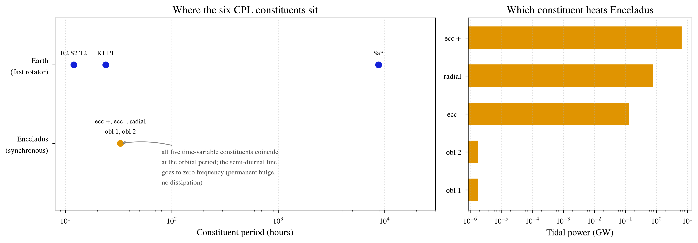

Tidal Constituents of a Synchronous Satellite: Enceladus
========================================================

Overview
--------

What **EqTide**'s six CPL tidal constituents do when the tidally forced body
is synchronously rotating, worked for Enceladus at Saturn.

===================   ============
**Date**              08/01/26
**Author**            Rory Barnes
**Modules**           EqTide
**Approx. runtime**   1 second
===================   ============

This is the companion to :code:`examples/SolarConstituents`. That example
takes the fast-rotator limit: Earth spins ~365 times per orbit, the six CPL
constituents separate cleanly, and each one lands on a named Doodson
constituent of the classical tide tables (S2, T2, R2, P1, K1).

Enceladus is the opposite limit. It is synchronously locked, so ``Omega = n``,
and the constituent structure collapses:

============  ==================  ==============  =========================
**EqTide**    **Frequency**       **At Omega=n**  **Result**
============  ==================  ==============  =========================
SemiDiurn     2*Omega - 2n        0               permanent bulge
EccPlus       2*Omega - 3n        n               orbital period
EccMinus      2*Omega -  n        n               orbital period
Radial                       n    n               orbital period
OblDiurn        Omega   - 2n      n               orbital period
OblSid          Omega             n               orbital period
============  ==================  ==============  =========================

**There is no M2/S2 doublet here, and there cannot be.** The semi-diurnal
splitting an oceanographer expects on Earth arises from a fast rotator
sampling two perturbers; Enceladus is a slow synchronous rotator with one
dominant perturber. Everything time-variable happens at one frequency.

Results
-------

Running ``makeplot.py`` prints::

                            period (h)   / orbit      amp (m)   power (GW)
    ----------------------------------------------------------------------
    SemiDiurn  permanent      infinite        --    1577.3398     0.000000
    EccPlus    ecc +           32.8923  1.000000      25.9487     6.512370
    EccMinus   ecc -           32.8923  1.000000       3.7070     0.132910
    Radial     radial          32.8923  1.000000       3.7070     0.797430
    OblDiurn   obl 1           32.8923  1.000000       0.0138     0.000002
    OblSid     obl 2           32.8923  1.000000       0.0138     0.000002
    ----------------------------------------------------------------------
    orbital period             32.8923 h
    total power               7.442710 GW

Three things are worth drawing out.

**The permanent tide does no work.** At exactly zero frequency the phase lag
is zero, so the semi-diurnal constituent carries no dissipation at all. Its
1577 m "amplitude" is the static tidal bulge, not an oscillation. That is the
right order: Enceladus is measurably triaxial at the km level.

**The heating splits in exact rational proportions.** Once ``Omega = n`` and
the obliquity vanishes, the CPL weights reduce to 24.5, 3 and 0.5 in units of
``e^2``, out of 28 total::

    ecc +         87.5000%          7/8
    radial        10.7142%          3/28
    ecc -          1.7858%          1/56

So the eccentricity tide is doing essentially all the work, and the obliquity
tides are irrelevant at Enceladus' (poorly constrained, very small) obliquity.

**The total reproduces the textbook result.** Summing the six constituents
and comparing against the standard closed form for a synchronous satellite,
computed independently of any **EqTide** code path::

    EqTide                     7.442710 GW
    (21/2)(k2/Q)GM^2R^5ne^2/a^6     7.442709 GW
    relative difference        1.35e-07

The agreement is limited only by the precision of the logged values. This is
a genuine cross-check: the factor 21/2 falls out of the CPL phase-lag weights
summed over constituents, and matches the analytic result exactly.

Caveats
-------

* **Amplitudes use a Kaula normalization, not the icy-satellite shorthand.**
  The reported amplitude is
  ``zeta = (M_pert/M_body) (R^4/a^3) F_2mp(psi) G_2pq(e) / 3``, with every
  inclination function divided by 3 so the principal semi-diurnal term is
  unity. Ratios *within* a species are exact. The satellite literature's
  familiar "3e radial, 4e librational" shorthand is a different convention
  (it is the coefficient of specific Legendre terms), so do not compare those
  numbers directly without converting. The frequencies and the powers carry
  no such ambiguity.
* **k_2 and Q for Enceladus are not well determined.** Tidal power scales as
  ``k_2/Q``; the values here (0.1/20) were chosen to land in the range of the
  observed south-polar heat flow, roughly 5-16 GW. They are illustrative, not
  a measurement. Reproducing the observed output from equilibrium tidal
  heating alone is the well-known Enceladus heat-budget problem.
* **The collapse depends on** ``bDiscreteRot``. It defaults to 1, so with
  ``e`` well below ``sqrt(1/19)`` the equilibrium spin is exactly ``n`` and
  the semi-diurnal frequency is exactly zero. Set ``bDiscreteRot 0`` and the
  equilibrium rate becomes ``(1 + 9.5e^2)n``; the semi-diurnal constituent
  then moves off zero to a long-period line rather than a permanent bulge.
  Which is physical depends on how you read the CPL truncation.
* **Obliquity is set to a small nonzero value** (0.0005 deg) purely so the
  obliquity constituents are visible rather than identically zero. Enceladus'
  obliquity is poorly constrained; the obliquity tides are negligible for any
  plausible value.
* **This is the equilibrium tide of the raising potential.** The observed
  ocean tide additionally carries the Love number combination
  ``(1 + k_2 - h_2)``, and a real ocean response involves resonances this
  model does not contain.

To run this example
-------------------

.. code-block:: bash

   python makeplot.py <pdf | png>

Expected output
---------------

Left: where the six constituents fall for a fast rotator (Earth, upper) and a
synchronous rotator (Enceladus, lower). Earth's six separate into three
species; Enceladus' five time-variable constituents pile onto the orbital
period while the semi-diurnal line drops to zero frequency. Right: the share
of tidal heating carried by each constituent.
