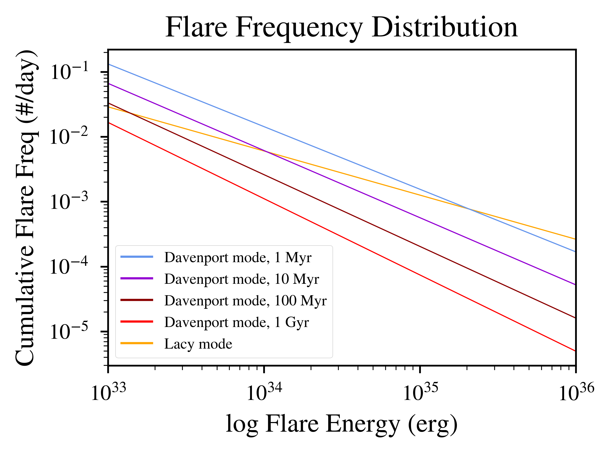

Flare frequency distribution of Proxima Centauri
====================================================================================================

Overview
--------

This example compares the models of flare frequency distribution proposed by Davenport et. al (2019) and Lacy et. al (1976).

===================   ============
**Date**              09/15/21
**Author**            Laura Amaral
**Modules**           FLARE
                      STELLAR
**Approx. runtime**   5 seconds
===================   ============

To run this example
-------------------

.. code-block:: bash

    python makeplot.py <pdf | png>

Expected output
---------------

   Flare frequency distribution (FFD) for Proxima Centauri between 10^34 and 10^36 ergs.
   The red, orange, dark blue, and pale blue lines represent the FFD from Davenport et. al (2019) at 1 Myr,
   10 Myr, 100 Myr and 1Gyr, respectively. The black line is the Lacy et. al (1976) model, where the FFD is
   constant for all the stellar ages.
