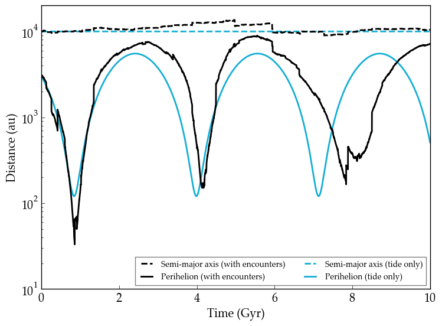

Galactic Evolution
================

Overview
--------

.. todo:: **@deitrr**: Change system names in vpl.in.

===================   ============
**Date**              07/25/18
**Author**            Russell Deitrick
**Modules**           galhabit
**Approx. runtime**   6 minutes
**Source code**       `GitHub <https://github.com/VirtualPlanetaryLaboratory/vplanet-private/tree/master/examples/galhabit>`_
===================   ============

An example of galactic migration and perturbations from passing stars.

To run this example
-------------------

.. code-block:: bash

    # Run the main example
    vplanet vpl.in

    # Run the `tides_only` example
    cd tides_only
    vplanet vpl.in
    cd ..

    # Plot the figure
    python makeplot.py <pdf | png>

Expected output
---------------

   Evolution of an M dwarf orbiting the sun under the influence of the galactic
   environment. The blue curves represent the evolution due to the galactic tide
   alone, while the black includes the effects of random stellar encounters. The
   dash curves are the semi-major axis (unaffected by the tide); the solid curves
   are the perihelion distance.
