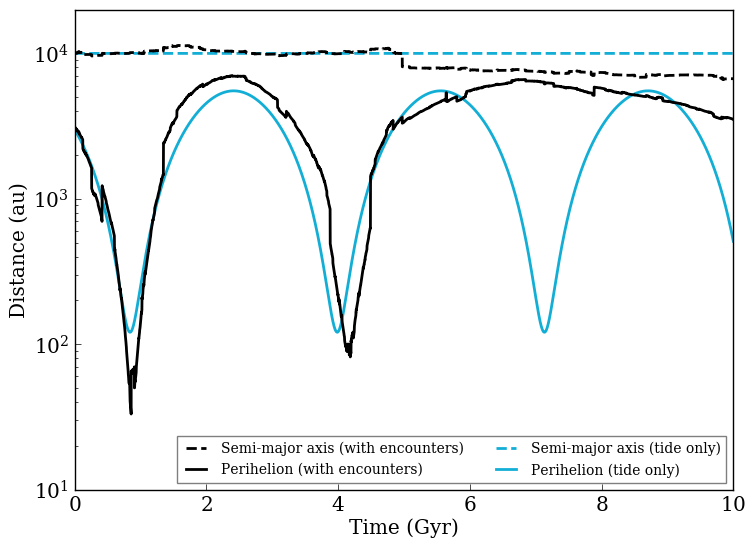

Evolution of a Wide Stellar Binary due to Galactic Effects
================

Overview
--------

Orbital evolution of objects in wide (>10,000 AU) orbits due to galactic migration,
the galactic tide, and passing field stars.

===================   ============
**Date**              07/25/18
**Author**            Russell Deitrick
**Modules**           GalHabit
**Approx. runtime**   1 minute
===================   ============

Wide orbits are subject to torques from the galactic tide, as well as impulses from
passing stars. Complicating the evolution is the possibility of migration, in which
stars can migrate multiple kpc from their birth location. This example shows that
evolution for an M dwarf orbiting a Sun-like star. This result is similar to Fig. 1 in `Kaib et al. (2013) <https://ui.adsabs.harvard.edu/abs/2013Natur.493..381K/abstract>`_, but note that we cannot reproduce it exactly to the random nature of encounters.

To run this example
-------------------

.. code-block:: bash

    # Plot the figure
    python makeplot.py <pdf | png>

Expected output
---------------

   Evolution of an M dwarf orbiting the Sun under the influence of the galactic
   environment. The blue curves represent the evolution due to the galactic tide
   alone, while the black includes the effects of random stellar encounters. The
   dash curves are the semi-major axis (unaffected by the tide); the solid curves
   are the perihelion distance. **Note:** The black curves include random effects,
   i.e. random numbers are generated by :code:`VPLanet`, so the curves are only qualitatively
   reproducible.
