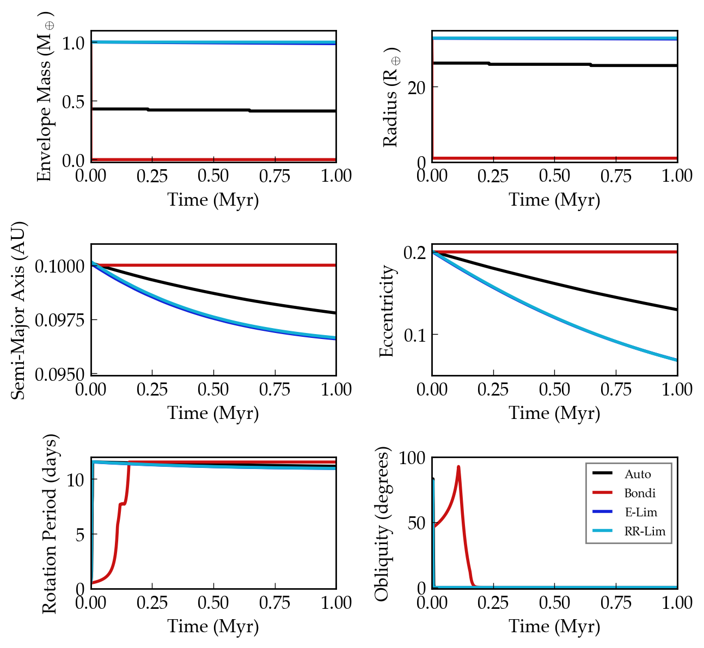

Hydrogen Envelope Loss on Tidally Evolving Planets
==================================================

Overview
--------

Many planets on short-period orbits experience tidal effects and atmospheric
escape simultaneously. This example demonstrates this coupling for planets with
a hydrogen envelope. Currently, only the CPL tidal model works for this process.

===================   ============
**Date**              02/28/2020
**Author**            Rory Barnes
**Modules**           AtmEsc
                      EqTide
**Approx. runtime**   5 seconds
===================   ============

To run this example
-------------------

.. code-block:: bash

    python makeplot.py <pdf | png>

Expected output
---------------

    Evolution of planets losing a hydrogen envelope, as modeled by Lopez
    et al. (2012), while tidally evolving according to the CPL model. In
    this case, H loss can proceed via Roche lobe overflow (Bondi-limited escape),
    radiation-recombination-limited escape, or energy-limited escape. The "Auto"
    mode self-consistently tracks escape through these regimes, see `AtmEscRegimes
    <../AtmEscRegimes>`_ for more details. Note that the
    escape efficiency parameter has been set artificially large (0.99) to reveal
    some mass loss over 1 Myr. The .in files for this figure are in the `Lopez12CPL
    <Lopez12CPL>`_ directory.
