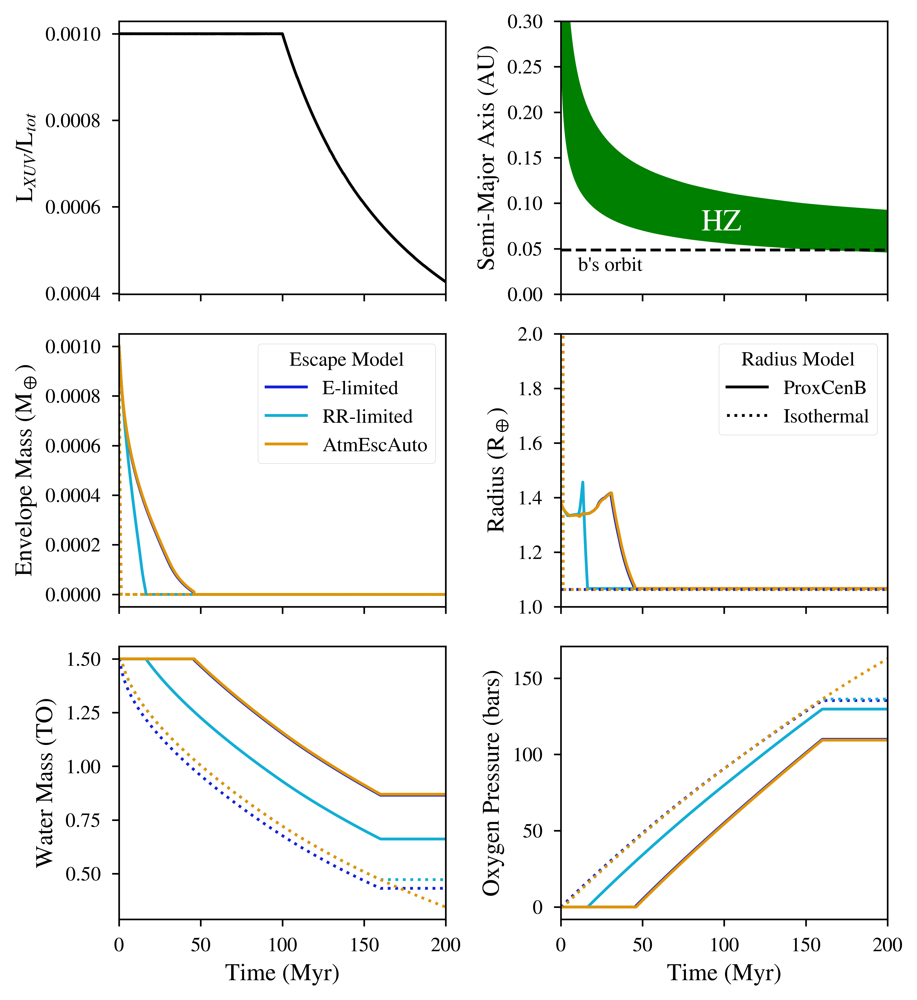

Proxima Centauri b as a "Habitable Evaporated Core."
=====================================================================================

Overview
--------

A planet orbiting in the main sequence habitable zone of a low mass star, e.g. Proxima Centauri b,
can lose a hydrogen envelope during the pre-main sequence. If the core is
volatile rich, then the planet may become habitable, but only if the water isn't
also lost via photolysis and hydrogen escape. This example demonstrates
this transition for 6 different assumptions: all possible combinations between
two different radius models and three
different escape models. The envelope radius may evolve according to a modified
version of the Lopez et al. (2012) radius tracks (ProxCenB) or the isothermal
model of Lehmer & Catling (2017). When a hydrogen envelope is present, the H may
escape via energy-limited escape, radiation-recombination-limited escape, Roche lobe overflow,
or an automatic mode in which the regime is selected based on the environment.

===================   ============
**Date**              02/26/2020
**Author**            Rory Barnes
**Modules**           AtmEsc
                      STELLAR
**Approx. runtime**   10 seconds
===================   ============

To run this example
-------------------

.. code-block:: bash

To run the simulations and make the plot:

.. code-block:: bash

    python makeplot.py < png | pdf >

Expected output
---------------

   Sample evolutions of Proxima b if it is a habitable evaporated core. *Top left:*
   The ratio of the XUV luminosity to the total luminosity. The early constant
   stage is known as the "saturated" phase, which is here set to 100 Myr. *Top
   right:* Comparison of the habitable zone (HZ) to the current orbit of
   Proxima b. The star evolves according to a modified track from Baraffe et al.
   (2016) that matches observations. *Middle left:* The envelope mass.
   For the ProxCenB radius model, AtmEscAuto selects the energy-limited (E-Lim)
   escape model for the duration of the simulation, so the dark blue curve is hidden by the
   orange curve for this panel and the
   subsequent panels. *Middle right:* Radius of the planet. The water layer is
   assumed to have no thickness. *Bottom left:* The amount of water on the surface
   in units of Earth oceans (TO). Except for the AtmEscAuto-Isothermal model, water is not
   permitted to photolyze if the envelope is present or if the planet is in the HZ. This feature
   can be toggled with the ``bStopWaterLossInHZ`` option. *Bottom right:* The maximum
   oxygen pressure that can accumulate in the atmosphere from water photolysis
   and hydrogen escape.
