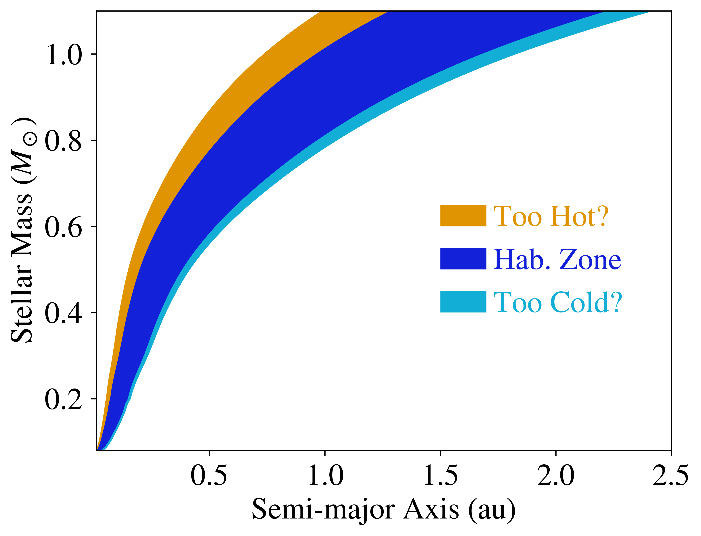

The Habitable Zone
==============

Overview
--------

Habitable zone limits from `Kopparapu et al. (2013) <https://ui.adsabs.harvard.edu/abs/2013ApJ...765..131K/abstract>`_
for stellar ages of 4.5 Gyr using the `Baraffe et al. (2015) <https://ui.adsabs.harvard.edu/abs/2015A%26A...577A..42B/abstract>`_
model grid.

===================   ============
**Date**              02/07/2022
**Author**            Rory Barnes
**Modules**           STELLAR, VSPACE, MultiPlanet
                      
**Approx. runtime**   1 minutes
===================   ============

To run this example
-------------------

.. code-block:: bash

    python makeplot.py <pdf | png>

Expected output
---------------

Dark blue is the "conservative" habitable zone (runaway greenhouse to maximum greenhouse),
orange and pale blue represent the optimistic extensions toward and away from the host
star, respectively.
