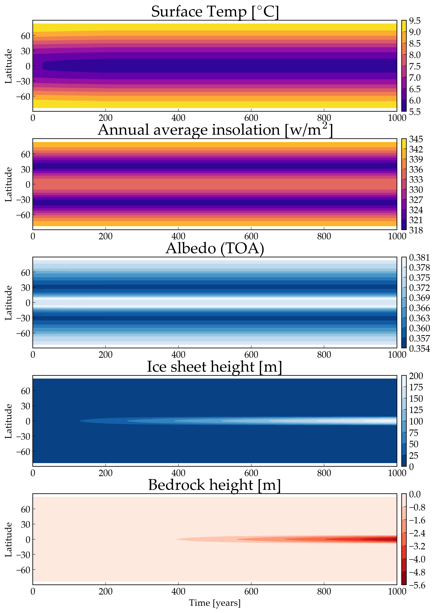
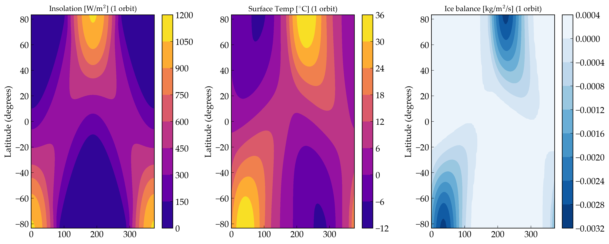

Ice Belt Formation on High Obliquity Planets
===================

Overview
--------

Formation on an ice belt on a terrestrial planet with high obliquity

===================   ============
**Date**              10/16/19
**Author**            Caitlyn Wilhelm
**Modules**           POISE
**Approx. runtime**   15 Seconds
===================   ============

This example validates **VPLanet**'s 1-D climate model by reproducing Figure 2
of  `Rose et. al (2017)
<https://iopscience.iop.org/article/10.3847/1538-4357/aa8306/meta#apjaa8306s2>`_.

To run this example
-------------------

.. code-block:: bash

    python makeplot.py <pdf | png>

Expected output
---------------

The climate evolution of an Earth-like planet at 1.02 AU with an obliquity of
55 degrees, and an eccentricity of 0. The surface temperature (top) shows that
over the course of the simulation the equator is colder than the poles, promoting
ice formation. The annual average insolation (2nd panel) shows the amount
of solar radiation reaching the surface: over the course of the simulation,
the ice belt forms because the equator receives *less* solar radiation than the poles.
Albedo (3rd panel) shows the reflectiveness of the planet a the top of the
atmosphere (TOA). Ice sheet height (4th panel), shows that
the ice sheet grows in height to approx 200m.  The bedrock height (5th panel)
shows that as the ice sheet grows in height, it compresses the bedrock downward,
i.e. the values are negative.

This figure shows the seasonal evolution of the planet over the course of its orbit.
Insolation (left panel) shows incident radiation as a function of latitude. The
middle panel shows the surface temperature. The ice balance (right panel) shows
the difference between ice growth and melting. Note that ice is more stable on the
equator than the poles.
