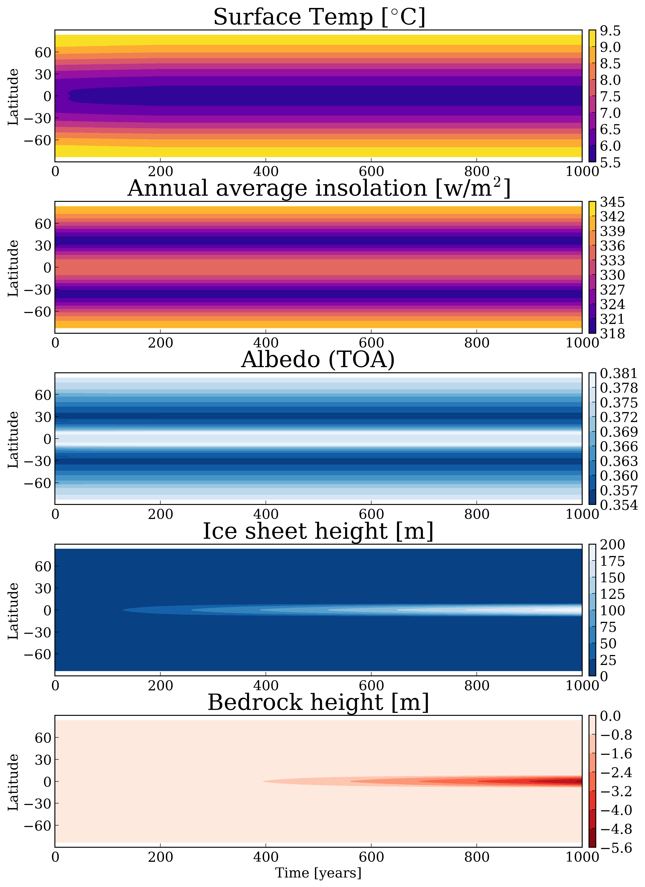
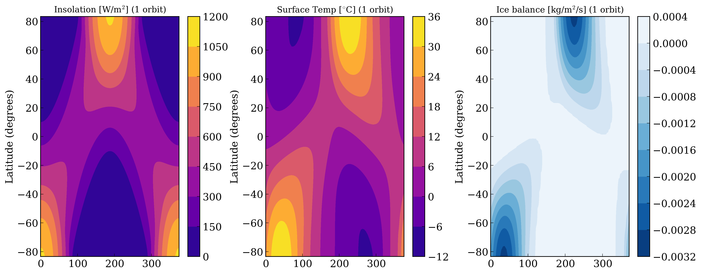

Ice Belt formation on High Obliquity Planets
===================

Overview
--------

Ice Belt formation on High Obliquity Planets

===================   ============
**Date**              10/16/19
**Author**            Caitlyn Wilhelm
**Modules**           POISE
**Approx. runtime**   14.6 Seconds
===================   ============

This example validates **VPLanet**'s 1-D climate model through reproducing the
results of Figure 2 of the `(Rose et. al 2017) <https://iopscience.iop.org/article/10.3847/1538-4357/aa8306/meta#apjaa8306s2>`_.
publication.

To run this example
-------------------

.. code-block:: bash

    vplanet vpl.in
    Python makeplot.py <pdf | png>

Expected output
---------------

The Climate Evolution of an Earth-like planet at 1.02 AU with an obliquity of 55 degrees,
and an eccentricity of 0.
The Surface Temperature (Top) shows that over the course of the simulation, the
equator is colder than the poles, thus ice formation occur. The Annual Average Insolation
(2nd panel) shows the amount of solar radiation reaching the surface, and over
the course of the simulation, the area where the Ice belt forms received *less*
solar radiation than the poles. Albedo (3rd panel) shows the reflectiveness of
the planet’s surface, and ice is more reflective than water. Ice Sheet Height
(4th panel), shows that as the simulation of the planet occurs, the ice sheet
grows in height to approx 200m. The Bedrock Height (5th panel), shows that as
the Ice Sheet grows in height, it compresses the bedrock downward.

This figure shows the Seasonal Evolution of Earth over the course of a single year.
Insolation (Panel 1), shows that over the course of the season, the planet receives
sunlight on the poles and the equator, but not enough to fully melt the Ice belts
before winter occurs. The surface temp (panel 2) shows the overall surface temperature
over the course of the season, and how it is colder near the equator than the poles. 
The Ice Balance (panel 3) shows the overall growth of the ice over the season, meaning
there is more ice along the equator than the poles.
