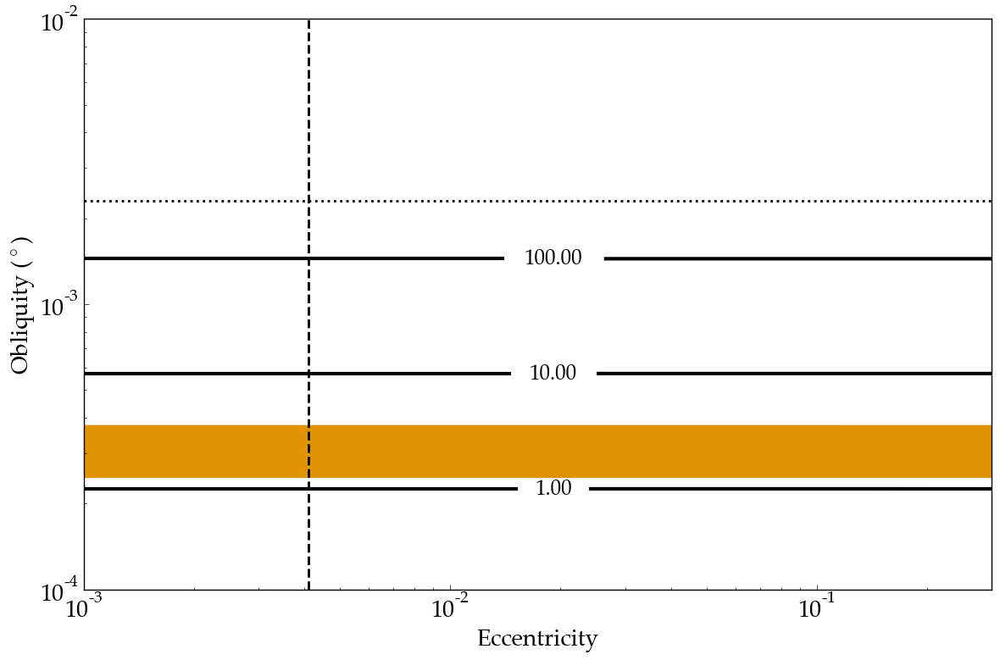

Tidal Heating of Io
==========

Overview
--------

Surface energy flux on Io due to tidal dissipation according to **EqTide**'s
"constant-phase-lag" model.

===================   ============
**Date**              07/25/18
**Author**            Rory Barnes
**Modules**           EqTide
**Approx. runtime**   1 minute
===================   ============

This example reproduces the surface energy flux on Io over a range of
eccentricity and obliquity. It also shows how to use `VSPACE <https://virtualplanetarylaboratory.github.io/VSPACE/>`_,
a python that can generate input files across a parameter range.
**VSPACE** will create a large number of directories, each of which has 3
input files. In this example, the `makeplot.py` script will run each individual
trial, gather the results, and create the summary plot below. The orange strip
corresponds to the observed heat flow of Io `(Veeder et al. 2012)
<https://ui.adsabs.harvard.edu/abs/2012Icar..219..701V/abstract>`_.

To run this example
-------------------

.. code-block:: bash

   python makeplot.py <pdf | png>

Expected output
---------------

Contour plot of surface tidal heat flux of Io as a function of its eccentricity
and obliquity. Contour units are W/m^2, the vertical line corresponds to Io's
observed eccentricity, and the horizontal line is the expected obliquity if Io
is in a Cassini state `(Bills & Ray 2000)
<https://ui.adsabs.harvard.edu/abs/2000JGR...10529277B/abstract>`_. The orange
shaded region corresponds to the observed value of 1.5-3 W/m^2 `(Veeder et al.
1)    <https://ui.adsabs.harvard.edu/abs/2012Icar..219..701V/abstract>`_.
