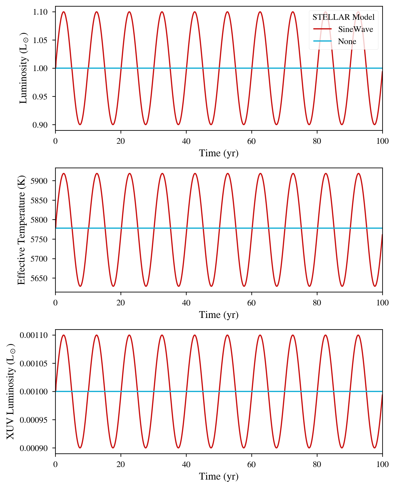

Sinusoidal Evolution of Luminosity
==================================

Overview
--------

Set the sStellarModel to "SineWave" to force a star's luminosity and temperature to oscillate
sinusoidally with user-defined amplitude and period.

===================   ============
**Date**              02/14/2024
**Author**            Rory Barnes
**Modules**           STELLAR
**Approx. runtime**   <1 second
===================   ============

To run this example
-------------------

.. code-block:: bash

   python makeplot.py <pdf | png>

Expected output
---------------

Luminosity (top) and effective temperature (bottom) evolutions for the SineWave and None choices for the
sStellarModel option.
