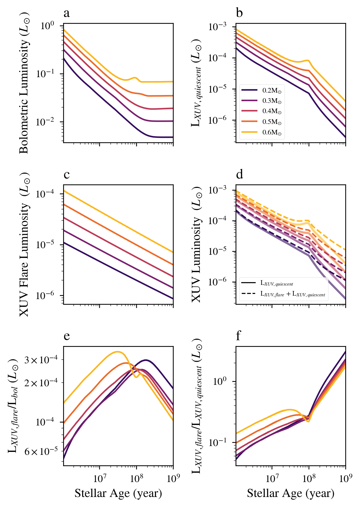

Luminosity evolution for stars with mass between 0.2 and 0.6 Msun.
===========================================================================

Overview
--------

This examples shows the luminosity evolution of five different M dwarf stars.

===================   ============
**Date**              7/26/2021
**Author**            Laura Amaral
**Modules**           FLARE
                      STELLAR
**Approx. runtime**   10 seconds
===================   ============

To run this example
-------------------

.. code-block:: bash

    python makeplot.py <pdf | png>

Expected output
---------------

   Evolution of the bolometric luminosity (top left),  quiescent XUV luminosity(top right),
    XUV luminosity by flares (middle left), Total XUV luminosity (quiescent + flares, middle
   right), XUV luminosity by flares and bolometric luminosity ratio (bottom left), XUV luminosity
   by flares and quiescent XUV luminosity ratio (bottom right).  In all cases, the the XUV
   luminosity by flares follows the Davenport et. al (2019) model for flare frequency distribution.
   Which color represents a different stellar mass. This Figure reproduces Fig. 5 in Amaral et. al (2022).
