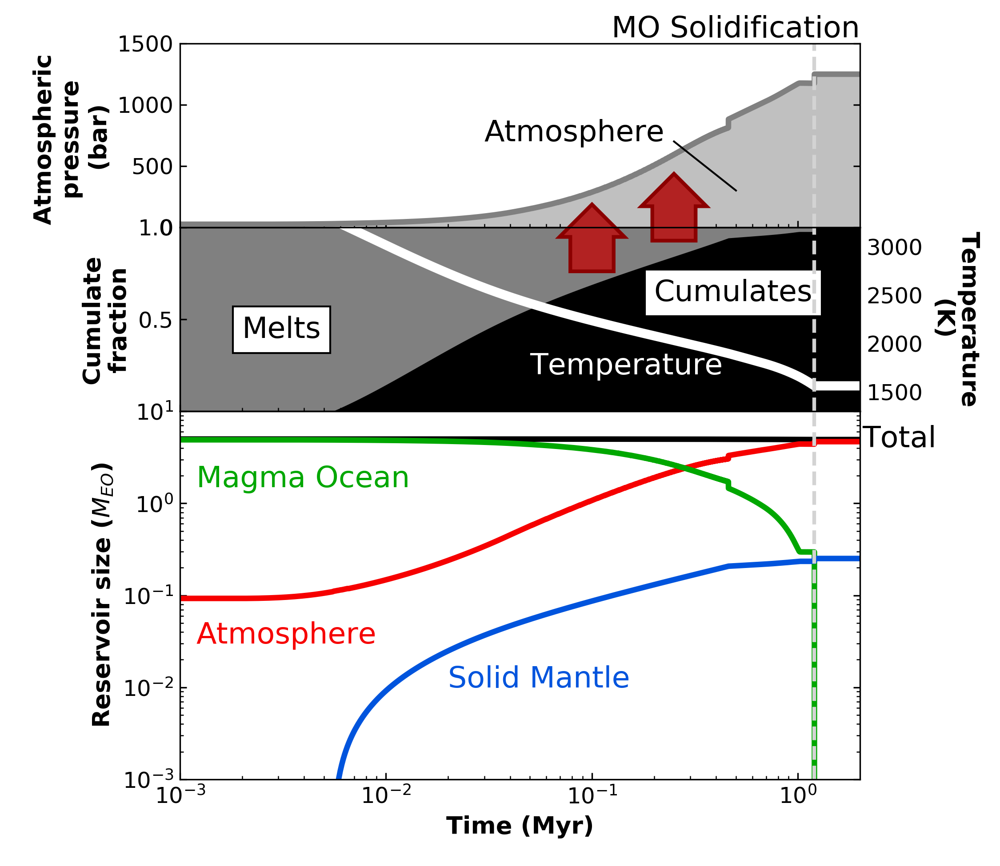

Magma Ocean Evolution of Earth
===========

Overview
--------

Simulation of the magma ocean and atmospheric evolution of Earth assuming it initially possessed 5 times as much water in the oceans as it does today.
This result approximately reproduces Fig. 1 in `Hamano et al. (2013) <https://doi.org/10.1038/nature12163>`_.

=========================   =======================
**Date**                    08/21/20
**Author**                  Patrick Barth
**Planet name**             Earth
**Initial water content**   5 TO
**Modules**                 AtmEsc, MagmOc, STELLAR
**Approx. runtime**         1 minute
=========================   =======================

To run this case:
-------------------

.. code-block:: bash

    python makeplot.py

Expected output
---------------

Evolution of atmospheric pressure (top), mantle temperature (middle: white line),
cumulate and melt fraction (middle: black and grey areas), and water content in
the different reservoirs (bottom: atmospere - red, magma ocean - green, solid - blue)
for Earth with an initial water reservoir of 5 terrestrial oceans.
The red arrows indicate the catastrophic outgassing of water into the atmosphere
when the melt fraction of the mantle decreases rapidly.
