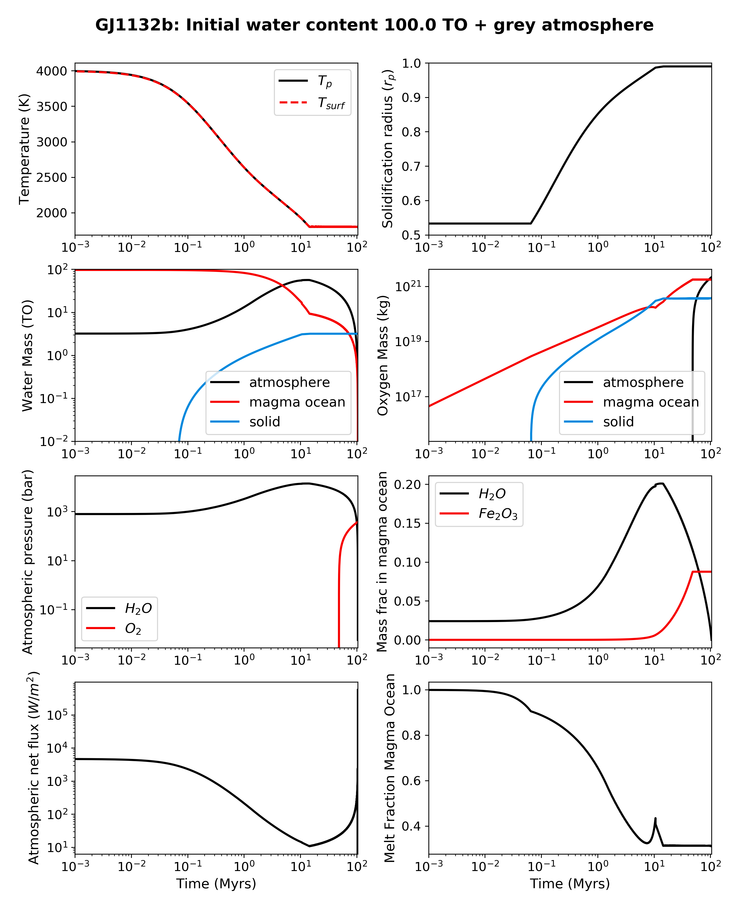

Magma ocean evolution on GJ 1132 b
===========

Overview
--------

Thermal and volatile evolution of GJ 1132 b's mantle and atmosphere during its magma ocean phase.

=========================   =======================
**Date**                    08/21/20
**Author**                  Patrick Barth
**Planet name**             GJ 1132 b
**Initial water content**   100 TO
**Modules**                 AtmEsc, MagmOc, STELLAR
**Approx. runtime**         3 minutes
=========================   =======================

To run this example
-------------------

.. code-block:: bash

    python makeplot.py

Expected output
---------------

Evolution of various planetary parameters for the magma ocean evolution of
GJ 1132 b with an initial water inventory that is 100 that of the modern Earth. The planet radiatively cools with VPLanet's grey
atmosphere model.
Counter-clockwise from top left: Mantle and surface temperature; water masses in the
different reservoirs; atmospheric pressures; atmospheric net cooling flux;
melt fraction of the magma ocean (not including solidified mantle); mass fraction
of water and Fe2O3 in the melt; oxygen mass in different reservoirs; solidification
radius of the magma ocean.
