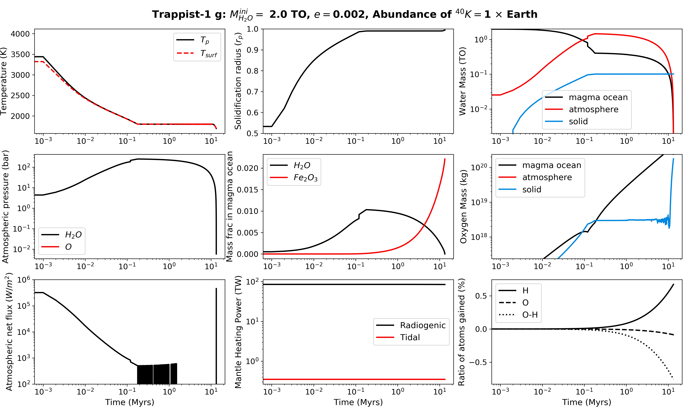

Magma ocean evolution of Trappist-1 g
===========

Overview
--------

Thermal and volatile evolution of Trappist-1 g's mantle and atmosphere during its magma ocean phase. This example assumes the initial water
inventory is twice modern Earth's value. Radiogenic and tidal heating of the mantle are included via the modules RadHeat and EqTide, respectively.
Atmospheric escape of hydrogen and oxygen is included via the AtmEsc module.

=========================   ========================================
**Date**                    08/21/20
**Author**                  Patrick Barth
**Planet name**             Trappist-1 g
**Initial water content**   2 TO
**Modules**                 AtmEsc, EqTide, MagmOc, RadHeat, STELLAR
**Approx. runtime**         1 minute
=========================   ========================================

To run this example
-------------------

.. code-block:: bash

    python makeplot.py

Expected output
---------------

Evolution of various planetary parameters for the magma ocean evolution of
Trappist-1 g with an initial water inventory of two times modern Earth's value.
Counter-clockwise from top left: Mantle and surface temperature; water masses in the
different reservoirs; atmospheric pressures; atmospheric net cooling flux;
radiogenic and tidal heating rates; mass fraction of water and Fe2O3 in the melt;
oxygen mass in different reservoirs; solidification radius of the magma ocean.
The high-frequency variations in the atmospheric flux and oxygen mass in the solid
are numerical artifacts due to the fact that the greenhouse effect forces
the cooling flux to be low and the surface temperature to stay constant over a
long time.
