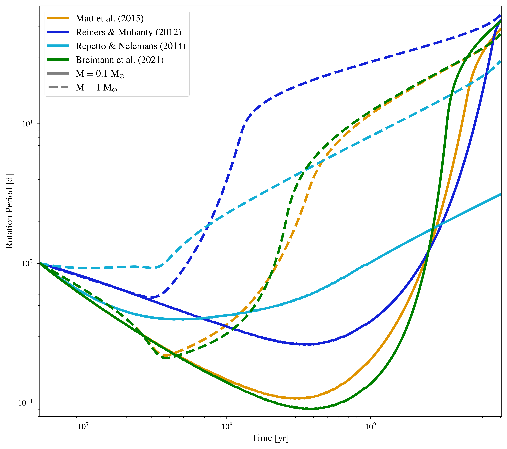

Stellar Magnetic Braking
=================

Overview
--------

Rotational evolution of stars due to magnetic effects.

===================   ============
**Date**              06/19/19
**Author**            David Fleming
**Modules**           STELLAR
**Approx. runtime**   2 minutes
===================   ============

Rotation period evolution for 0.1 and 1.0 solar-mass stars due to stellar
evolution and magnetic braking. This example shows how the three available
magnetic braking laws (`Reiners & Mohanty [2012] <https://ui.adsabs.harvard.edu/abs/2012ApJ...746...43R/abstract>`_, `Repetto & Nelemans [2014] <https://ui.adsabs.harvard.edu/abs/2014MNRAS.444..542R/abstract>`_,
and `Matt et al. [2015] <https://ui.adsabs.harvard.edu/abs/2015ApJ...799L..23M/abstract>`_) impact the rotation period.

This example also demonstrates how the VPLanet implementation of the `Matt et al. [2015] <https://ui.adsabs.harvard.edu/abs/2015ApJ...799L..23M/abstract>`_
magnetic braking model can be used to reproduce the upper enveloped of the Kepler
field stellar rotation period distribution, a main result from `Matt et al. [2015] <https://ui.adsabs.harvard.edu/abs/2015ApJ...799L..23M/abstract>`_.

To run this example
-------------------

.. code-block:: bash

    python makeplot.py <pdf | png>

Expected output
---------------

Rotation period evolution of 0.1 and 1 solar-mass stars due to stellar evolution
(`Baraffe et al. 2015 <https://ui.adsabs.harvard.edu/abs/2015A%26A...577A..42B/abstract>`_) and the three magnetic braking laws.

.. figure:: kepler.png
   :width: 100%
   :align: center

Rotation period distribution of a ~4 Gyr-old synthetic cluster of stars
simulated using STELLAR with the `Matt et al. [2015] <https://ui.adsabs.harvard.edu/abs/2015ApJ...799L..23M/abstract>`_ magnetic braking model
(black, adapting VPLanet simulations from `Fleming et al. [2019] <https://ui.adsabs.harvard.edu/abs/2019arXiv190305686F/abstract>`_). Following Fig. (3) in
Matt et al. [2015], we compare the `Fleming et al. [2019] <https://ui.adsabs.harvard.edu/abs/2019arXiv190305686F/abstract>`_ simulated distribution to
the rotation distribution of Kepler field stars (red) measured by
`McQuillan et al. [2014] <https://ui.adsabs.harvard.edu/abs/2014ApJS..211...24M/abstract>`_. For reference, we plot the modern solar rotation period
as a blue star. Using STELLAR, `Fleming et al. [2019] <https://ui.adsabs.harvard.edu/abs/2019arXiv190305686F/abstract>`_
recover the `Matt et al. [2015] <https://ui.adsabs.harvard.edu/abs/2015ApJ...799L..23M/abstract>`_
result that the upper envelope of the Kepler stellar rotation period
distribution is well-matched by a 4 Gyr-old synthetic cluster, validating the
STELLAR implementation of the `Matt et al. [2015] <https://ui.adsabs.harvard.edu/abs/2015ApJ...799L..23M/abstract>`_ magnetic braking model.
