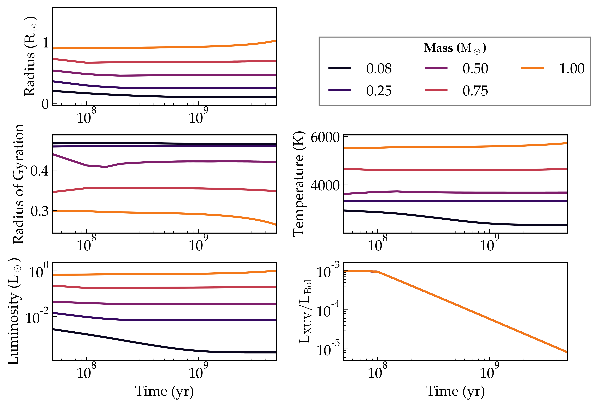

Stellar evolution
=================

Overview
--------

.. todo:: Change ranges to [0.075, 0.2, 0.4, 0.6, 0.8, 1.0, 1.2, 1.4, 2]??

===================   ============
**Date**              07/25/18
**Author**            Rodrigo Luger
**Modules**           stellar
**Approx. runtime**   2 minutes
**Source code**       `GitHub <https://github.com/VirtualPlanetaryLaboratory/vplanet-private/tree/master/examples/stellar>`_
===================   ============

Stellar evolution for stars between 0.1 and 1.0 solar masses.

To run this example
-------------------

.. code-block:: bash

    python makeplot.py <pdf | png>

Expected output
---------------

   Evolution of the radius, luminosity, temperature, and period of stars
   of different masses according to the Baraffe (2015) :cite:`Baraffe15`
   stellar evolution tracks.
