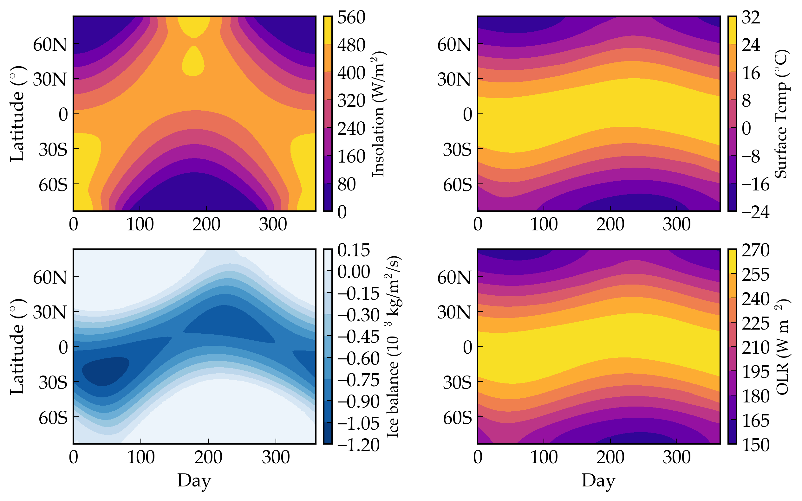

Seasonal and Milankovitch Climate Cycles
===================

Overview
--------

===================   ============
**Date**              07/25/18
**Author**            Russell Deitrick
**Modules**           poise
                      distorb
                      distrot
**Approx. runtime**   5 minutes
**Source code**       `GitHub <https://github.com/VirtualPlanetaryLaboratory/vplanet-private/tree/master/examples/Milankovitch>`_
===================   ============

Validation of **VPLANET**'s 1-D climate model with dynamic ice sheets over seasonal
and Myr timescales.

To run this example
-------------------

.. code-block:: bash

    vplanet vpl.in
    python makeplot.py <pdf | png>

Expected output
---------------

Insolation (upper left), surface temperature (upper right), ice mass balance
(lower left), and out-going longwave radiation (lower right), for Earth over a
single year, as modeled by `poise`. Note that negative values in ice mass balance
represent **potential** melting, i.e. this value is calculated even in the
absence of ice on the surface.

.. figure:: MilankovitchComp.png
   :width: 600px
   :align: center

Ice sheet evolution for Earth with (upper panels) and without (middle panels)
isostatic depression and rebound of the bedrock. Also shown is the difference
(lower panels). The left panels show the ice sheet height/altitude; the right
panels show the surface density of the ice. Without the bedrock model, the ice
grows taller (in elevation), but there is less ice overall because the surface
does not sink under the weight of the ice.
