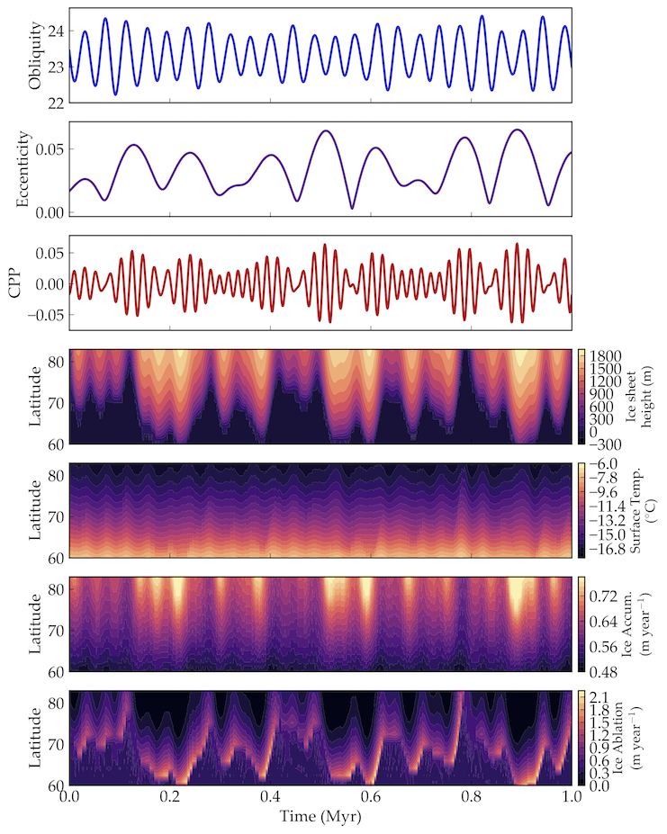

Milankovitch cycles
===================

Overview
--------

===================   ============
**Date**              07/25/18
**Author**            Russell Deitrick
**Modules**           `eqtide <../src/eqtide.html>`_
                      `stellar <../src/stellar.html>`_
**Approx. runtime**   16 minutes (!!)
**Source code**       `GitHub <https://github.com/VirtualPlanetaryLaboratory/vplanet-private/tree/master/examples/Milankovitch>`_
===================   ============

.. todo:: **@rdeitrick**: Description needed for the **Milankovitch** example.

To run this example
-------------------

.. code-block:: bash

    vplanet vpl.in
    python makeplots.py

Expected output
---------------

.. todo:: **@rdeitrick**: Caption needed for the **Milankovitch** example figure.

