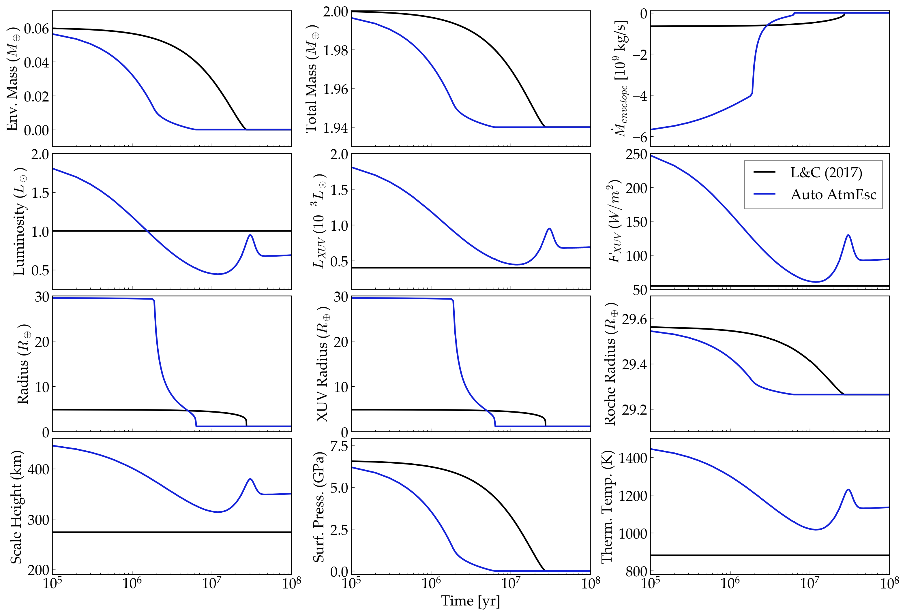

Atmospheric Erosion of Mini-Neptunes with the Lehmer & Catling (2017) Model
===========================================================================

Overview
--------

This examples compares the atmospheric erosion of two "mini-Neptunes" using the
H envelope model from Lehmer & Catling (2017).

===================   ============
**Date**              10/15/2019
**Author**            Rory Barnes, Diego McDonald
**Modules**           AtmEsc
                      STELLAR
**Approx. runtime**   10 seconds
===================   ============

To run this example
-------------------

.. code-block:: bash

    python makeplot.py <pdf | png>

Expected output
---------------

   Evolution of the H envelope mass (top left), total planet mass  (top center),
   time derivative of the envelope mass (top right), stellar luminosity (upper
   middle left), XUV luminosity (upper middle center), incident XUV flux (upper
   middle left), planet radius (lower middle left), XUV radius (lower middle
   center), Roche lobe radius (lower middle right), envelope scale height (bottom
   left), surface pressure (bottom center), and the envelope's temperature
   (bottom right). In both cases, the envelope follows the planetary radius
   model of Lehmer & Catling (2017). The black line assumes constant luminosity,
   thermal temperature, incident flux, and assumes the planet loses mass via
   energy limited escape; this case reproduces Fig. 3 in Lehmer & Catling (2017).
   The blue curve includes stellar evolution, assumes the thermal temperature
   responds to the evolving radiation field, and that the escape can transition
   between radiation-recombination-limited escape and energy-limited escape,
   i.e. bAtmEscAuto is set to 1. For this latter case, the radius model predicts
   the initial radius exceeds the Roche limit, and so `VPLanet` forces all the
   mass to be contained within that radius and forces the radius to equal the
   Roche radius.
