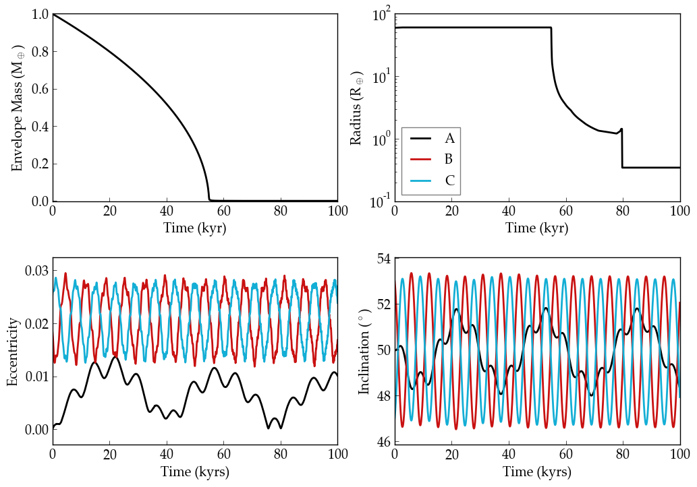

Coupling Atmospheric Escape and N-Body Evolution: Application to PSR1257+12
============

Overview
--------

Coupled atmospheric and orbital evolution of the PSR1257+12 pulsar planetary
system. This example connects the energy-limited escape/Lopez et al. (2012)
envelope model to the N-Body module SpiNBody.

===================   ============
**Date**              03/10/2020
**Author**            Rory Barnes
**Modules**           AtmEsc SpiNBody
**Approx. runtime**   30 min
===================   ============

The orbital parameters are taken from `Konacki & Wolszczan (2003)
<https://ui.adsabs.harvard.edu/abs/2003ApJ...591L.147K/abstract>`_. The
XUV luminosity of the pulsar is assumed to be 0.001
L_sun, which is about 3 times larger than the X-ray luminosity found by
`Pavlov etal. (2007) <https://ui.adsabs.harvard.edu/abs/2007ApJ...664.1072P/abstract>`_.
The initial envelope mass of planet A is 1 Earth mass, with a core mass
of 0.02 Earth masses, which is the currently observed value `Konacki & Wolszczan
(2003) <https://ui.adsabs.harvard.edu/abs/2003ApJ...591L.147K/abstract>`_. While such an
initial composition seems unlikely, the large mass loss allows for the coupling
to be apparent in a simulation that requires ~1 hour to complete. Mass loss for
the B and C companions can occur of billion year timescales, see the
`AtmEsc <AtmEsc>`_ directory. The mass of the pulsar is 1.4 solar masses
`Gozdziewski et al. (2005) <https://ui.adsabs.harvard.edu/abs/2005ApJ...619.1084G/abstract>`_.

To run this example
-------------------

.. code-block:: bash

    python makeplot.py <pdf | png>

Expected output
---------------

**Top left**: Envelope mass of planet A. **Top right**: Radius of planet A.
**Bottom left**: Eccentricity evolution of all planets. **Bottom right**:
Inclination evolution of all planets. Note the second and third eccentricity
cycles are lower than the first, which is due to A's mass loss. Compare to Fig.
1 in `Gozdziewski et al. (2005) <https://ui.adsabs.harvard.edu/abs/2005ApJ...619.1084G/abstract>`_.
