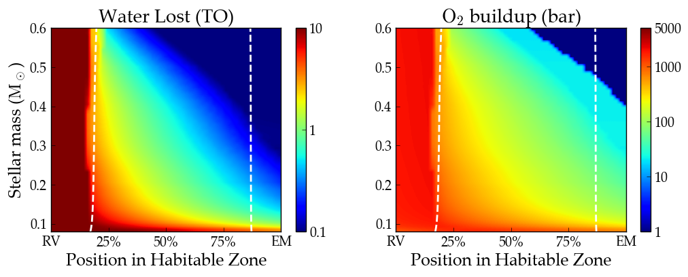

Oxygen Buildup
==============

Overview
--------

Track water loss and oxygen build-up due to hydrodynamic atmospheric escape.

===================   ============
**Date**              07/25/18
**Author**            Rodrigo Luger
**Modules**           atmesc
                      stellar
**Approx. runtime**   10 minutes (!!)
**Source code**       `GitHub <https://github.com/VirtualPlanetaryLaboratory/vplanet-private/tree/master/examples/o2buildup>`_
===================   ============

This script reproduces Figure 7 in Luger and Barnes (2015) :cite:`LugerBarnes2015`.

To run this example
-------------------

.. note::

    You might need to install :code:`tqdm`:

    .. code-block:: bash

        pip install tqdm

.. code-block:: bash

    python makeplot.py <pdf | png>

Expected output
---------------

   Water loss and oxygen buildup for planets orbiting in the habitable
   zones of M dwarfs. The extended pre-main sequence phase of low mass
   stars leads to vigorous hydrodynamic escape from planets in their
   habitable zone, causing the loss of surface water (left) and the
   buildup of atmospheric oxygen (right). See :cite:`LugerBarnes2015`
   for more details.
.. todo:: **@rodluger** Investigate the single outlier in the water loss plot of the `o2buildup` example.
