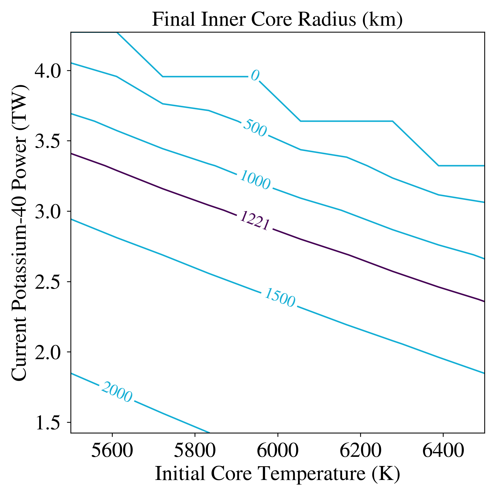

Parameter Sweep Example
=======================

Overview
--------

Example using :code:`VSPACE`, :code:`MultiPlanet`, and :code:`BigPlanet` to
explore how ThermInt parameters dTCore (initial core temperature) and 
d40KPowerCore (initial radiogenic power from potassium-40) predict the radius
of Earth's inner core.

===================   ============
**Date**              1/26/2021
**Author**            Caitlyn Wilhelm
**Modules**           ThermInt, VSPACE, MultiPlanet, BigPlanet
**Approx. runtime**   160 Seconds
===================   ============

To run this example
-------------------

.. code-block:: bash

    python makeplot.py <pdf | png>

Expected output
---------------

Inner core radius of Earth after 4.5 Gyr as a function of the initial core
temperature and the current power from potassium-40 decay. The black curve
is the current value.
