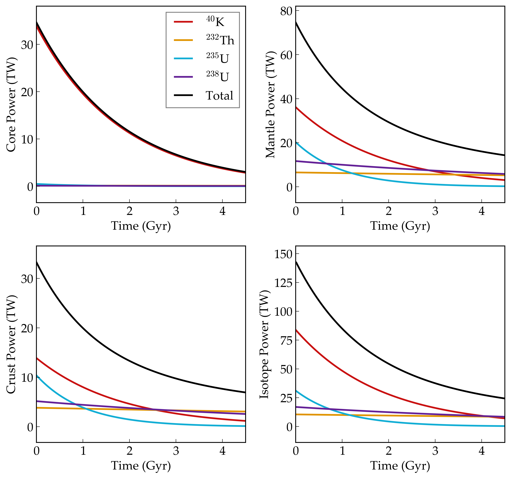

Radiogenic Heating of Earth
==========

Overview
--------

Radiogenic heating in Earth's interior.

===================   ============
**Date**              09/12/18
**Author**            Rory Barnes
**Modules**           RadHeat
**Approx. runtime**   1 second
===================   ============

This example shows the power generated by radioactive elements in Earth's interior as predicted by our `nominal Earth model <../EarthInterior>`_.

To run this example
-------------------

.. code-block:: bash

   python makeplot.py <pdf | png>

Expected output
---------------

History of radiogenic power generation in Earth's core, mantle, and crust, as well as by isotope.
