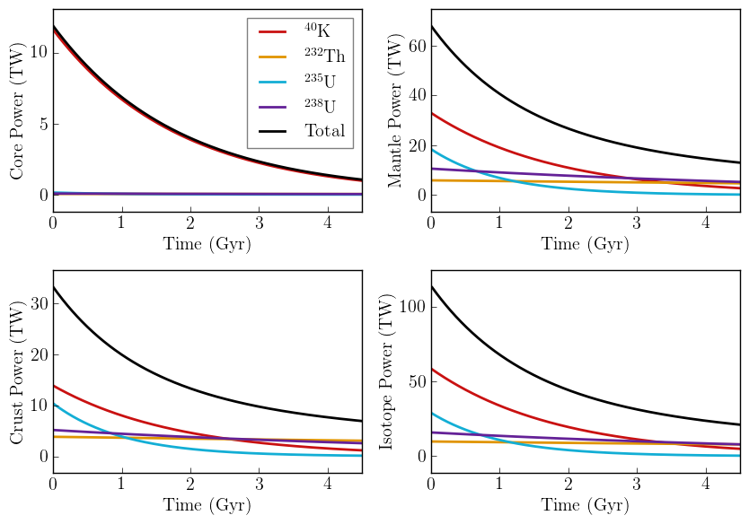

RadHeat
==========

Overview
--------

===================   ============
**Date**              09/12/18
**Author**            Rory Barnes
**Modules**           `radheat <../src/radheat.html>`_
**Approx. runtime**   <1 second
**Source code**       `GitHub <https://github.com/VirtualPlanetaryLaboratory/vplanet-private/tree/master/examples/RadHeat>`_
===================   ============

To run this example
-------------------

.. code-block:: bash

   vplanet vpl.in
   python makeplot.py

Expected output
---------------

History of radiogenic power generation in Earth by component and isotope.
