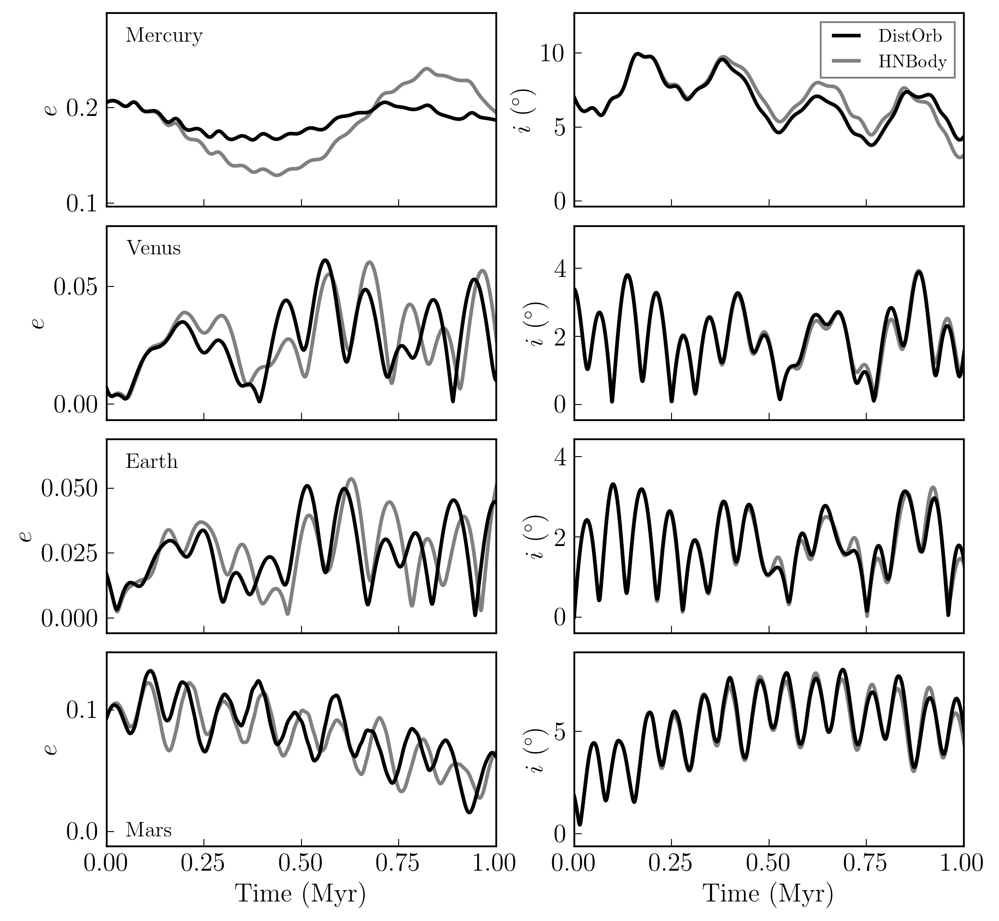
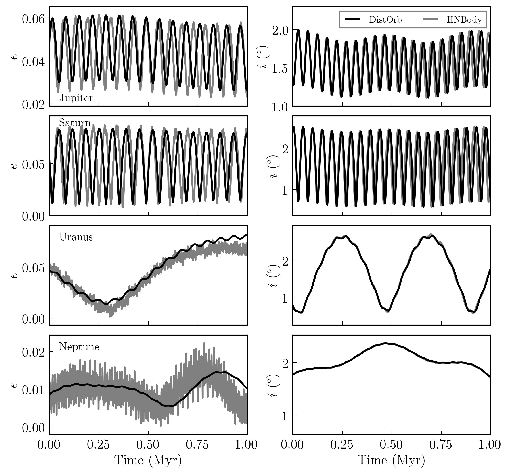
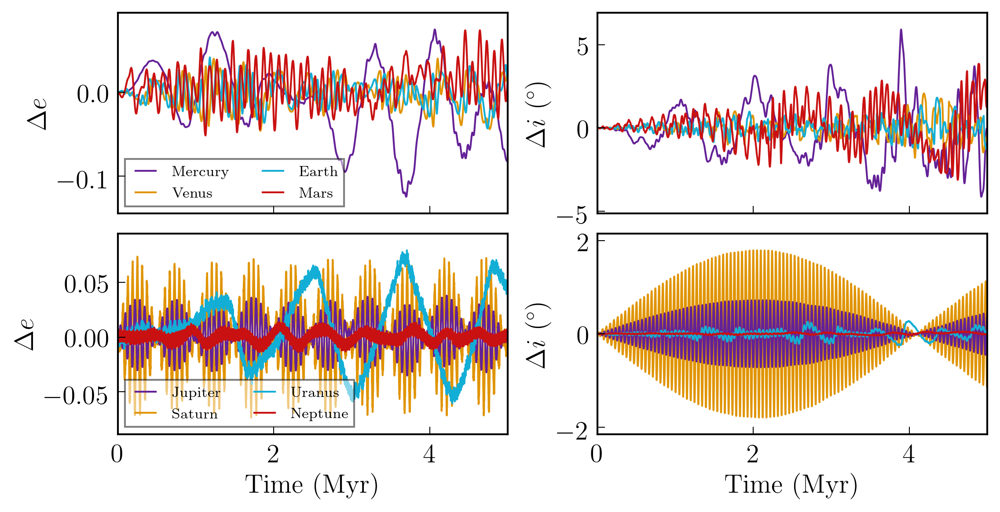
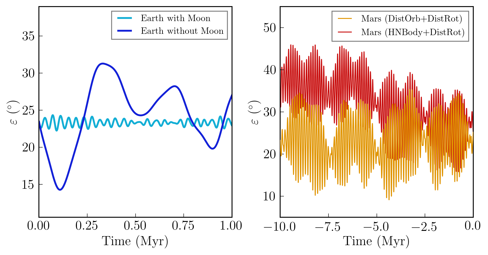

Solar System Orbital Dynamics from Secular Theory
=====================

Overview
--------

Orbital and rotational evolution of the Solar System.

===================   ============
**Date**              07/24/18
**Author**            Russell Deitrick
**Modules**           DistOrb
                      DistRot
**Approx. runtime**   | 116 seconds (:code:`vpl.in`)
                      | 112 seconds (:code:`womoon/`)
                      | 25 seconds (:code:`marshnb/`)
                      | 110 seconds (:code:`marsvpl/`)
===================   ============

This example uses **DistOrb** to model the orbits of the solar system planets and
**DistRot** to model the obliquity evolution of Earth and Mars. In this main
directory, the precession of the Earth's spin axis is forced to its present
day value to emulate the effect of the Moon. In the `womoon <womoon>`_ directory,
the same simulation is run, but without this precessional forcing. The
directory `marsvpl <marsvpl>`_ contains a simulation of Mars' obliquity backward in time
using **DistOrb** and **DistRot**. This result can be compared to `marshnb <marshnb>`_ output, which utilizes
orbital data from :code:`HNBody` (`Rauch & Hamilton 2002 <https://ui.adsabs.harvard.edu/abs/2002DDA....33.0802R/abstract>`_) to demonstrate the effects
of secular resonances not resolved by **DistOrb**. Note that **DistRot** can use orbital
elements generated by non-**VPLanet** sources.

To run this example
-------------------

.. code-block:: bash

    python makeplot.py <png | pdf>

Expected output
---------------

   Eccentricity evolution (left) and inclination evolution (right) for the
   inner solar system planets over the next 1 Myr. Initial condition are taken
   from Appendix A of `Murray & Dermott (1999) <https://ui.adsabs.harvard.edu/abs/1999ssd..book.....M/abstract>`_.

    Eccentricity evolution (left) and inclination evolution (right) for the
    outer solar system planets over the next 1 Myr. Initial condition are taken
    from Appendix A of `Murray & Dermott (1999) <https://ui.adsabs.harvard.edu/abs/1999ssd..book.....M/abstract>`_.

   Absolute errors in the eccentricity (left) and inclination (right) between 4th order DistOrb
   and HNBODY over 5 Myr.  Upper panels show the inner solar system planets and lower panels
   show the outer planets.

   Obliquity evolution of Earth with and without the Moon over the next Myr
   (left) and Mars using secular and N-body models for the orbit over the
   last 10 Myr (right).
