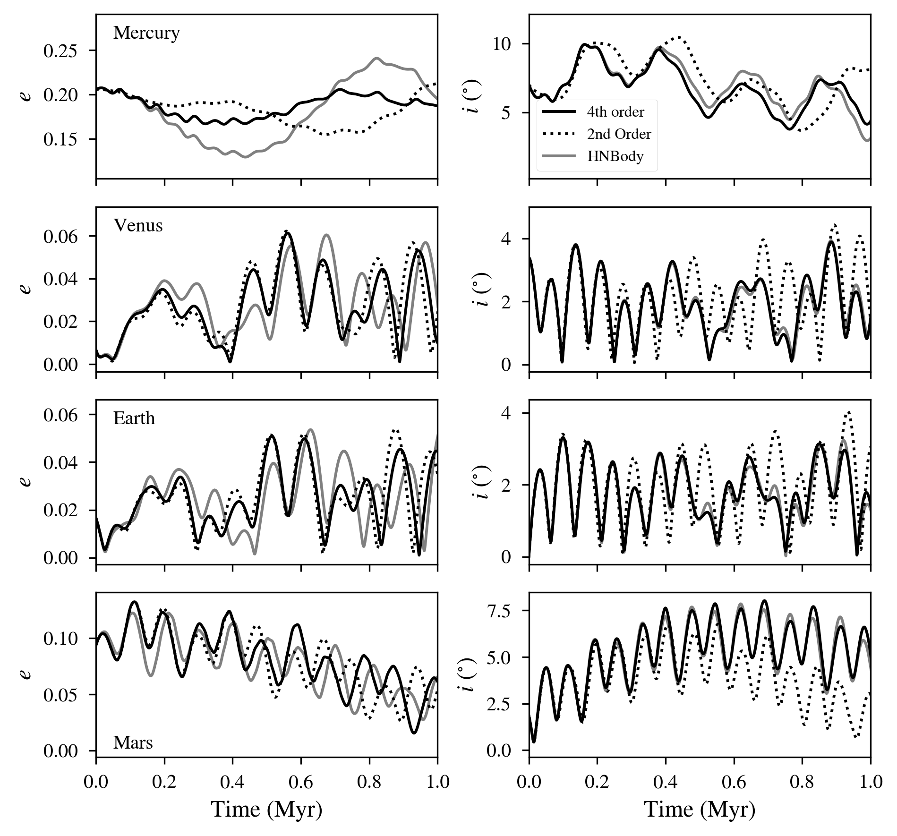

Solar System Orbital Dynamics from Secular Theory
=====================

Overview
--------

Orbital and rotational evolution of the Solar System.

===================   ============
**Date**              07/24/18
**Author**            Russell Deitrick
**Modules**           DistOrb
                      DistRot
**Approx. runtime**   | 116 seconds (:code:`vpl.in`)
                      | 112 seconds (:code:`womoon/vpl.in`)
                      | 25 seconds (:code:`marshnb/vpl.in`)
                      | 110 seconds (:code:`marsvpl/vpl.in`)
**Source code**       `GitHub <https://github.com/VirtualPlanetaryLaboratory/vplanet-private/tree/master/examples/dist_solsys2>`_
===================   ============

This example uses **DistOrb** to model the orbits of the solar system planets and
**DistRot** to model the obliquity evolution of Earth and Mars. In this main
directory, the precession of the Earth's spin axis is forced to its present
day value to emulate the effect of the Moon. In the `womoon` directory,
the same simulation is run, but without this precessional forcing. The
directory `marsvpl` contains a simulation of Mars' obliquity backward in time
using **DistOrb** and **DistRot**. This is compared to `marshnb`, which utilizes
orbital data from HNBody (Rauch & Hamilton 2002) to demonstrate the effects
of secular resonances not resolved by **DistOrb**. Note that **DistRot** can use orbital
elements generated by non-**VPLanet** sources.

To run this example
-------------------

.. code-block:: bash

    # Run the main script
    vplanet vpl.in

    # Run the script without the Earth's moon
    cd womoon
    vplanet vpl.in
    cd ..

    # Run the Mars N-Body script
    cd marshnb
    vplanet vpl.in
    cd ..

    # Run the Mars vplanet script
    cd marsvpl
    vplanet vpl.in
    cd ..

    python makeplot.py <png | pdf>

Expected output
---------------

   Eccentricity evolution (left) and inclination evolution (right) for the
   inner solar system planets over the next 1 Myr. Initial condition are taken
   from Appendix A of :cite:`MurrayDermott99`.

.. figure:: SSDistOrbDistRotOuter.png
   :width: 600px
   :align: center

   Eccentricity evolution (left) and inclination evolution (right) for the
   outer solar system planets over the next 1 Myr. Initial condition are taken
   from Appendix A of :cite:`MurrayDermott99`.

.. figure:: SSDistOrbDistRotObliq.png
   :width: 600px
   :align: center

   Obliquity evolution of Earth with and without the Moon over the next Myr
   (left) and Mars using secular and N-body models for the orbit over the
   last 10 Myr (right).
