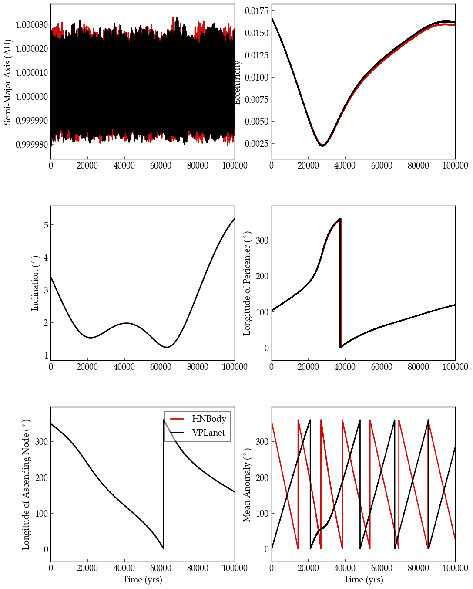

N-body Orbital Evolution of the Solar System
============

.. warning::

    This example is currently broken. Check out
    `this issue <https://github.com/VirtualPlanetaryLaboratory/vplanet-private/issues/300>`_.

Overview
--------

Orbital evolution from an N-body model.

===================   ============
**Date**              10/30/18
**Author**            Hayden Smotherman
**Modules**           SpiNBody
**Approx. runtime**   20 min (VPLanet)
                      10 Min (HNBody; optional)
===================   ============

This example uses SpiNBody to model the orbits of the solar system planets and compares
the results to a similar simulation run by :code:`HNBody` v1.0.10 (`Rauch & Hamilton 2002 <https://ui.adsabs.harvard.edu/abs/2002DDA....33.0802R/abstract>`_). The output files for
hnbody are generated using the :code:`HNBody` input script :code:`SpiNBody_Comparison.hnb`.

To run this example
-------------------

.. code-block:: bash

    # Run hnbody (optional)
    hnbody ss.hnb

    # Make the plots
    python makeplot.py <pdf | png>

Expected output
---------------

Evolution of Earth's slowly varying orbital elements in a Solar System simulation over the next
100,000 years. Black is **VPLanet** results; red is :code:`HNBody`. The lower right panel shows the energy and angular   momentum conservation for **VPLanet** only.
