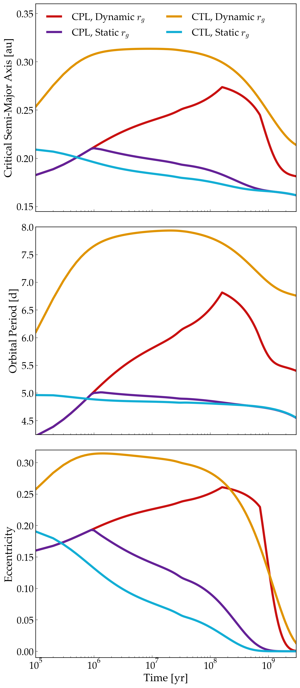

STEEP: Coupled Stellar-Tidal Evolution of Binary Orbits
================================================

Overview
--------

This example examines the coupled stellar-tidal evolution of binary orbits. This figure,
adapted from Graham et al. in prep, demonstrates how the early transfer of angular
momentum from the stellar spins into the orbit expands the binary orbit. This expansion
can destabilize any circumbinary planets that tend to orbit near the dynamical
stability limit, also known as the critical semi-major axis. This effect, deemed
STEEP (Stellar-Tidal Ejection of ExoPlanets) was first studied in Fleming et al. (2018).

===================   ============
**Date**              02/28/20
**Author**            David Fleming
**Modules**           EQTIDE STELLAR
**Approx. runtime**   5 minutes
===================   ============

To run this example
-------------------

.. code-block:: bash

    python makeplot.py <pdf | png>

Expected output
---------------

   Critical semi-major axis (top), orbital period (middle), and orbital
   eccentricity (bottom) vs. time for four solar twin stellar binaries undergoing
   coupled stellar-tidal evolution. This simulation explores how an evolving
   radius of gyration (Dynamic r_g) can supply additional angular momentum to
   the binary orbit vs the constant (Static) r_g case, further expanding the
   binary orbit, potentially destabilizing and CBPs that may orbit near the
   dynamical stability limit.
