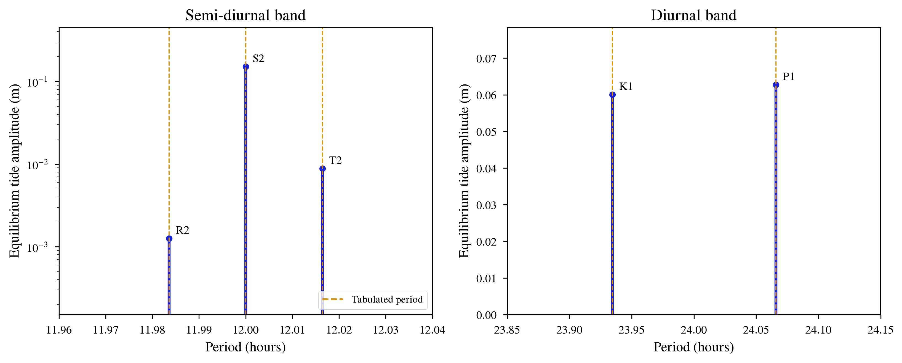

Solar Tidal Constituents on Earth
=================================

Overview
--------

Validation of **EqTide**'s Darwin-Kaula constituent decomposition against the
named solar constituents of the classical oceanographic tide tables.

===================   ============
**Date**              07/31/26
**Author**            Rory Barnes
**Modules**           EqTide
**Approx. runtime**   1 second
===================   ============

**EqTide**'s constant-phase-lag (CPL) model expands the degree-2 tide-raising
potential into six discrete harmonics, each with its own frequency and
amplitude. Historically the code evaluated those frequencies only to take
their sign, since that is all a constant-phase-lag model needs; the
``TidalFreq``, ``TidalAmp`` and ``TidalPower`` outputs now report the
frequency, equilibrium tide amplitude and dissipated power of each
constituent individually.

This is the same decomposition physical oceanographers use, and for the
Earth-Sun system every one of the six CPL constituents coincides with a named
Doodson constituent:

============  ==================  ================  ===============
**EqTide**    **Kaula (l,m,p,q)** **Frequency**     **Doodson**
============  ==================  ================  ===============
SemiDiurn     (2,2,0,0)           2*Omega - 2n      S2
EccPlus       (2,2,0,+1)          2*Omega - 3n      T2
EccMinus      (2,2,0,-1)          2*Omega -  n      R2
Radial        (2,0,1,+1)                       n    Sa (see below)
OblDiurn      (2,1,0,0)             Omega   - 2n    P1
OblSid        (2,1,1,0)             Omega           K1 (solar part)
============  ==================  ================  ===============

Here ``Omega`` is Earth's **sidereal** rotation rate and ``n`` the annual mean
motion. Their difference is what converts the 23.934 h sidereal day into the
24.000 h mean solar day, which is why the principal semi-diurnal line falls at
exactly 12 hours.

Results
-------

Running ``makeplot.py`` prints the comparison table. The periods are
reproduced essentially exactly::

               Doodson    period (h)    reference       err     amp (m)
    ------------------------------------------------------------------------
    SemiDiurn  S2          12.000000    12.000000  4.33e-09    0.151168
    EccPlus    T2          12.016449    12.016449  3.04e-08    0.008847
    EccMinus   R2          11.983596    11.983596 -2.40e-08    0.001264
    OblDiurn   P1          24.065888    24.065890 -9.67e-08    0.062763
    OblSid     K1          23.934472    23.934470  9.71e-08    0.060062
    Radial     Sa*       8766.165025  8766.152700  1.41e-06    0.001049

``Sa*`` is a loose identification. **EqTide** places this line at the
Keplerian mean motion, i.e. the *sidereal* year (365.256363 d), while
Doodson's ``Sa`` is defined on the *tropical* year (365.2422 d). The two
differ by the precession of the equinoxes, which **EqTide** does not model,
so the reference above is the sidereal year. The other five identifications
are exact.

The amplitudes are compared as ratios *within* each species, because the
harmonic tables carry a different geodetic normalization for the long-period,
diurnal and semi-diurnal species. Against the Cartwright & Tayler (1971)
expansion the agreement is a few parts in a thousand::

    ratio                EQTIDE    Cartwright-Tayler        err
    T2/S2              0.058521             0.058459   1.06e-03
    R2/S2              0.008360             0.008372  -1.36e-03
    K1/P1              0.956965             0.958616  -1.72e-03

The residuals are consistent with **EqTide**'s truncation of the eccentricity
functions at O(e) in amplitude, plus rounding in the published tables.

Finally, the six per-constituent powers sum to ``PowerEqtide``, which is
computed by a completely separate code path::

    S2           0.56570142
    T2           0.00229897
    R2           0.00004705
    P1           0.05310941
    K1           0.05340102
    Sa           0.00000039
    sum          0.67455825
    PowerEqtide  0.67455825

Caveats
-------

* The amplitude reported is that of the **raising potential**, expressed as an
  equilibrium surface displacement. The observed ocean tide additionally
  carries the Love number combination ``(1 + k_2 - h_2)``; **EqTide** tracks
  ``k_2`` but not ``h_2``, so that correction is left to the user.
* The tabulated ``Sa`` amplitude is dominated by radiational (thermal and
  meteorological) forcing rather than gravity, so it is listed for
  completeness and is not a test of this expansion. See also the note above
  on the sidereal versus tropical year.
* The Doodson identifications above hold for a **fast rotator with a single
  perturber**. They are not general. A synchronous rotator such as Enceladus
  has ``Omega = n``, which sends the semi-diurnal frequency to zero (the
  permanent tide) and collapses the remaining five constituents onto the
  orbital frequency. There is no M2/S2 doublet in that regime; the
  time-variable tide is the eccentricity tide at the orbital period.
* These outputs are CPL-only. They are disabled under CTL, which is a
  continuous-lag model with no discrete constituents, and under DB15.

To run this example
-------------------

.. code-block:: bash

   python makeplot.py <pdf | png>

Expected output
---------------

The six constituents plotted against period, split by species. Dashed orange
lines mark the tabulated Doodson periods; the modeled lines sit on top of
them.
