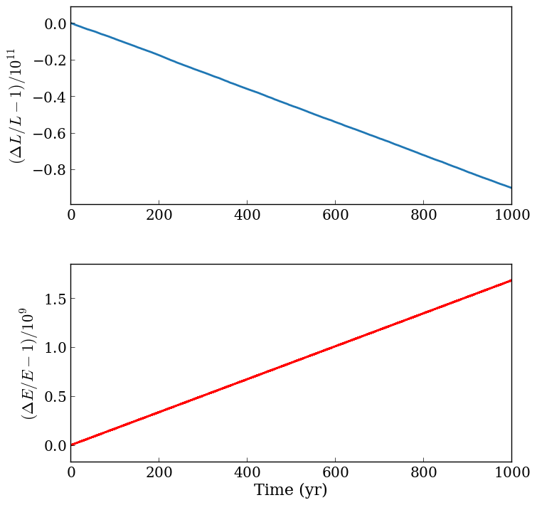

❌ spinbody
============

Overview
--------

===================   ============
**Date**              10/30/18
**Author**            Hayden Smotherman
**Modules**           `spinbody <../src/spinbody.html>`_
**Approx. runtime**   | 27 seconds (:code: `solarsystem_spinbody/vpl.in`)
**Source code**       `GitHub <https://github.com/VirtualPlanetaryLaboratory/vplanet-private/tree/master/examples/spinbody>`_
===================   ============

Uses SpiNBody to model the orbits of the solar system planets. Compares the
results to a similar simulation run by HNBody v1.0.10. The output files for
hnbody are generated using the HNBody input script in
:code: `solarsystem_spinbody/SpiNBody_Comparison.hnb`.

To run this example
-------------------

.. code-block:: bash
    # Run the Solar System example
    vplanet vpl.in
    python makeplots.py

Expected output
---------------

.. figure:: SpiNBody_Comparison.png
   :width: 600px
   :align: center

   Evolution of Earth's orbital elements in a Solar System simulation over the next
   1000 years. Blue is VPlanet results. Red is HNBody results.

   Conservation of orbital angular momentum (top) and orbital energy (bottom) for
   the entire Solar System simulation.
