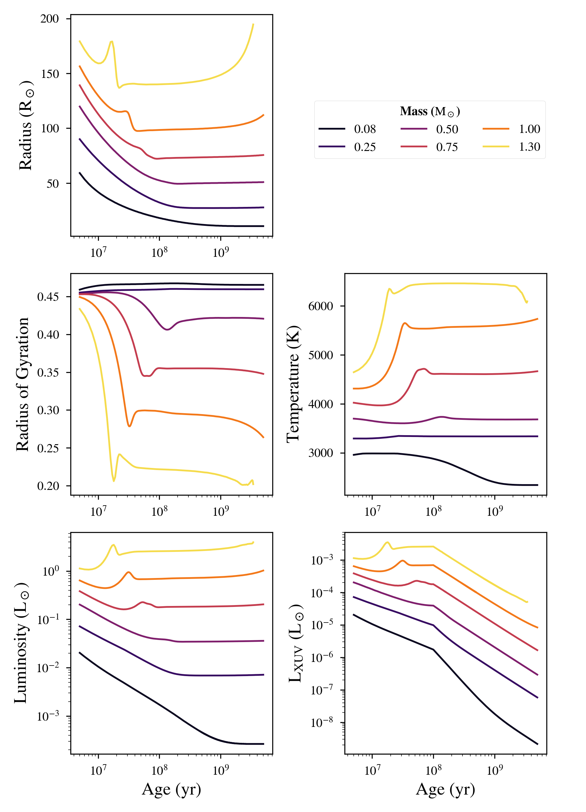

(Pre-)Main Sequence Stellar Evolution
=================

Overview
--------

Stellar evolution for stars between 0.1 and 1.3 solar masses.

===================   ============
**Date**              07/25/18
**Author**            Rodrigo Luger
**Modules**           STELLAR
**Approx. runtime**   2 minutes
===================   ============

This example shows the evolution of pre- and main sequence stars as predicted by
`Baraffe et al. (2015) <https://ui.adsabs.harvard.edu/abs/2015A%26A...577A..42B/abstract>`_ using the **STELLAR** module. **VPLanet** interpolates the results of that paper, accounting
for the changes that occur as convection sets in for higher mass stars.

To run this example
-------------------

.. code-block:: bash

    python makeplot.py <pdf | png>

Expected output
---------------

Evolution of the radius, radius of gyration, luminosity, XUV luminosity,
and temperature of stars according to the `Baraffe et al. (2015) <https://ui.adsabs.harvard.edu/abs/2015A%26A...577A..42B/abstract>`_ stellar evolution tracks.
