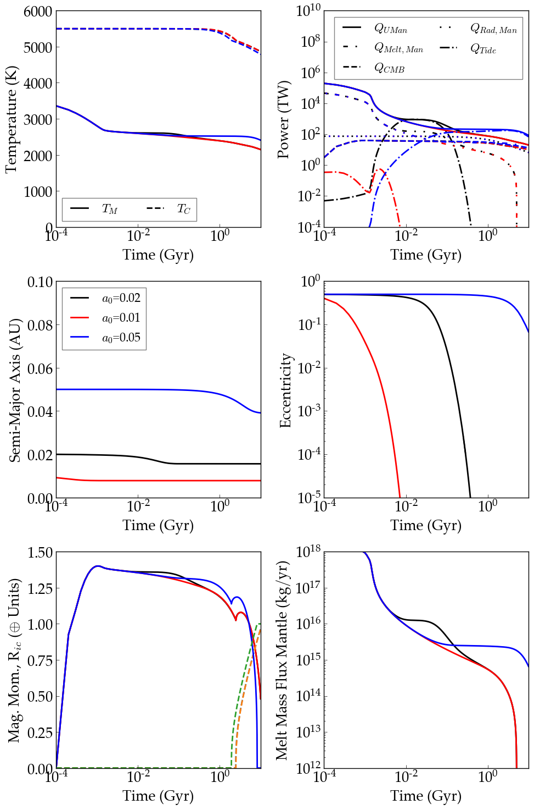
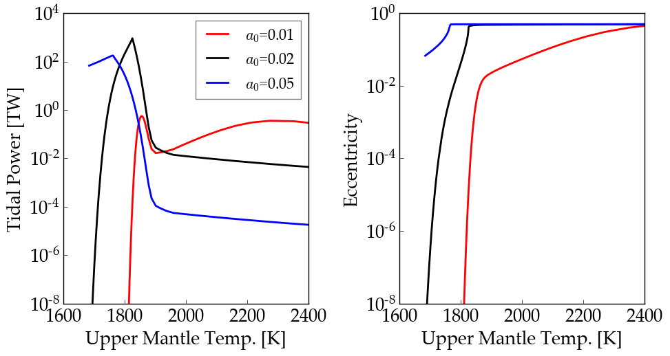

Tidal Evolution of Earth-like Exoplanet
==========

Overview
--------

Internal and orbital evolution of Earth if it experienced strong tidal distortion
from its host star.

===================   ============
**Date**              04/09/19
**Author**            Peter Driscoll
**Modules**           RadHeat, ThermInt, EqTide
**Approx. runtime**   10 minutes
===================   ============

This example shows the thermal, magnetic, and orbital evolution of an
Earth-like planet using **ThermInt**, **RadHeat**, and **EqTide**. Here we use the "orbit-only" tidal model, which is highly idealized.
The interior model is 1-D and many free parameters have been
tuned to match `the modern Earth <../EarthInterior>`_.  This example reproduces the results of
`Driscoll & Barnes (2015) <https://ui.adsabs.harvard.edu/abs/2015AsBio..15..739D/abstract>`_.  The generated
figures should be compared to their Figures 4 and 5.

To run this example
-------------------

.. code-block:: bash

   python makeplot.py <pdf | png>

Expected output
---------------

Evolution of various properties of a tidally heated Earth-like planet. The initial
eccentricity is 0.5, but the semi-major axis varies. The tidal model is very
simplified and ignores rotational angular momentum.
